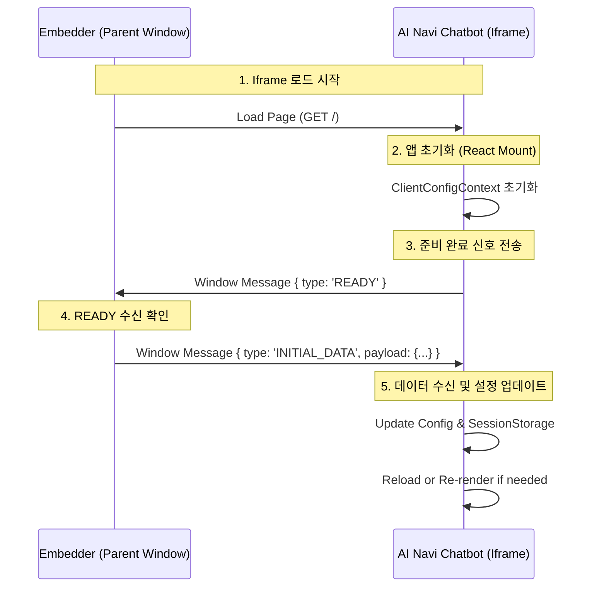

# postMessage 연동 가이드 및 테스트 페이지 구현 방법

이 문서는 외부 시스템(부모 창 또는 WebView)에서 `ai-navi-outbound-cs-314community-frontend` 애플리케이션을 `iframe`으로 임베딩하고, `postMessage`를 통해 초기화 데이터(`INITIAL_DATA`)를 안전하게 주입하는 방법과 이를 테스트하기 위한 페이지 구현 방법을 상세히 설명합니다.

## 1. 통신 프로토콜 (Handshake Protocol)

애플리케이션과 임베더(Embedder) 간의 통신은 다음과 같은 순서로 이루어집니다.

### 시퀀스 다이어그램



### 메시지 규격

#### 1. READY (Chatbot -> Parent)
챗봇 앱이 로드되고 메시지를 받을 준비가 되었음을 알립니다.

*   **Type**: `READY`
*   **Target**: `parent` (부모 윈도우) 또는 `ReactNativeWebView`

```json
{
  "type": "READY"
}
```

#### 2. INITIAL_DATA (Parent -> Chatbot)
부모 윈도우가 챗봇 앱에 초기화 데이터를 전달합니다.

*   **Type**: `INITIAL_DATA`
*   **Payload Schema**:

```typescript
interface WebViewInitialData {
  clientId: string;           // (필수) 클라이언트 ID (예: "RS000001")
  appId: string;              // (필수) 앱 ID (예: "0001")
  userId: string;             // (필수) 사용자 고유 ID
  greeting?: {                // (선택) 맞춤형 인사말
    main: string;
    sub: string;
  } | null;
  isEnableLearningNavi?: boolean; // (선택) 학습 내비 기능 활성화 여부
  isRequestedLearningOnboarding?: boolean; // (선택) 학습 온보딩 요청 여부
}
```

---

## 2. 테스트 페이지 구현 가이드 (Test Harness)

`postMessage` 연동을 테스트하기 위한 간단한 HTML 페이지 구현 방법입니다. 이 페이지는 개발 로컬 환경이나 별도의 호스팅 서버에 배치하여 챗봇과의 통신을 검증할 수 있습니다.

### 파일 구조
`test-loader.html` (예시 파일명)

### 구현 상세

#### A. HTML 구조
테스트에 필요한 입력 폼과 타겟 Iframe을 배치합니다.

```html
<!DOCTYPE html>
<html>
<head>
    <title>Chatbot Integration Test</title>
    <style>
        .container { display: flex; gap: 20px; }
        .controls { width: 300px; padding: 20px; border-right: 1px solid #ccc; }
        .preview { flex: 1; height: 90vh; }
        iframe { width: 100%; height: 100%; border: 1px solid #eee; }
    </style>
</head>
<body>
    <div class="container">
        <!-- 설정 컨트롤 패널 -->
        <div class="controls">
            <h3>Configuration</h3>
            
            <label>Target URL:</label>
            <input type="text" id="targetUrl" value="http://localhost:5173" />
            
            <label>Client ID:</label>
            <input type="text" id="clientId" value="RS000001" />
            
            <label>User ID:</label>
            <input type="text" id="userId" value="TEST_USER_01" />
            
            <label>App ID:</label>
            <input type="text" id="appId" value="0001" />
            
            <label>Greeting Main:</label>
            <input type="text" id="greetingMain" value="안녕하세요! 테스트입니다." />
            
            <div style="margin-top: 10px;">
                <label>
                    <input type="checkbox" id="isEnableLearningNavi" />
                    Enable Learning Navi
                </label>
            </div>

            <div style="margin-top: 5px;">
                <label>
                    <input type="checkbox" id="isRequestedLearningOnboarding" />
                    Request Learning Onboarding
                </label>
            </div>
            
            <button onclick="loadChatbot()" style="margin-top: 15px;">Load Chatbot</button>
            <hr/>
            <div id="logs"></div>
        </div>

        <!-- 챗봇이 로드될 영역 -->
        <div class="preview">
            <iframe id="chatFrame" title="Chatbot Preview"></iframe>
        </div>
    </div>
</body>
</html>
```

#### B. JavaScript 로직
Iframe과 통신하는 핵심 로직입니다.

```javascript
<script>
    const frame = document.getElementById('chatFrame');
    const logs = document.getElementById('logs');

    // 1. 로그 유틸리티
    function log(msg) {
        const div = document.createElement('div');
        div.textContent = `[${new Date().toLocaleTimeString()}] ${msg}`;
        logs.prepend(div);
    }

    // 2. 메시지 리스너 등록 (READY 수신용)
    window.addEventListener('message', (event) => {
        // 보안: 출처 확인 (실제 운영 시에는 필수)
        // if (event.origin !== document.getElementById('targetUrl').value) return;

        if (event.data && event.data.type === 'READY') {
            log('Received READY signal from Chatbot');
            sendInitialData();
        }
    });

    // 3. 챗봇 로드 함수
    function loadChatbot() {
        const targetUrl = document.getElementById('targetUrl').value;
        log(`Loading iframe: ${targetUrl}`);
        frame.src = targetUrl; // Iframe 로드 시작 -> 완료 후 READY 전송됨
    }

    // 4. 데이터 전송 함수
    function sendInitialData() {
        const payload = {
            clientId: document.getElementById('clientId').value,
            userId: document.getElementById('userId').value,
            appId: document.getElementById('appId').value,
            greeting: {
                main: document.getElementById('greetingMain').value,
                sub: ''
            },
            isEnableLearningNavi: document.getElementById('isEnableLearningNavi').checked,
            isRequestedLearningOnboarding: document.getElementById('isRequestedLearningOnboarding').checked
        };

        const message = {
            type: 'INITIAL_DATA',
            payload: payload
        };

        log('Sending INITIAL_DATA...');
        // Iframe으로 메시지 전송
        // '*' 대신 정확한 타겟 오리진을 사용하는 것이 보안상 좋습니다.
        frame.contentWindow.postMessage(JSON.stringify(message), '*'); 
    }
</script>
```

## 3. 테스트 시나리오 및 검증

### 시나리오 1: 기본 연동 확인
1.  로컬에서 Chatbot 앱 실행 (`npm run dev`, 보통 `http://localhost:5173`)
2.  `test-loader.html`을 브라우저로 열기.
3.  Target URL을 `http://localhost:5173`으로 설정.
4.  `Load Chatbot` 버튼 클릭.
5.  **검증**:
    *   로그창에 `Received READY signal`이 찍히는지 확인.
    *   로그창에 `Sending INITIAL_DATA`가 찍히는지 확인.
    *   Iframe 내의 챗봇이 설정한 `Greeting Main` 텍스트("안녕하세요! 테스트입니다.")를 말풍선으로 표시하는지 확인.
    *   개발자 도구(F12) > Application > Session Storage (Iframe 선택)에서 `clientId`, `userId`가 입력한 값으로 저장되었는지 확인.

### 시나리오 2: 데이터 변경 테스트
1.  Client ID나 Greeting 텍스트를 변경.
2.  `Load Chatbot` 버튼을 다시 클릭 (Iframe 리로드).
3.  **검증**: 변경된 인사말과 설정이 반영되는지 확인.

### 주의사항
*   **CORS/Origin**: 로컬 파일(`file://`)에서 테스트 시 브라우저 보안 정책으로 `postMessage`가 제한될 수 있습니다. `test-loader.html`도 간단한 로컬 서버(`http://localhost:XXXX`) 위에서 실행하는 것을 권장합니다 (`npx serve .` 등 사용).
*   **JSON Serialization**: `ClientConfigContext.tsx`는 JSON 문자열과 객체 모두를 처리할 수 있도록 구현되어 있습니다 (`typeof event.data === 'string'`). 위 예제에서는 호환성을 위해 `JSON.stringify`를 사용했습니다.
