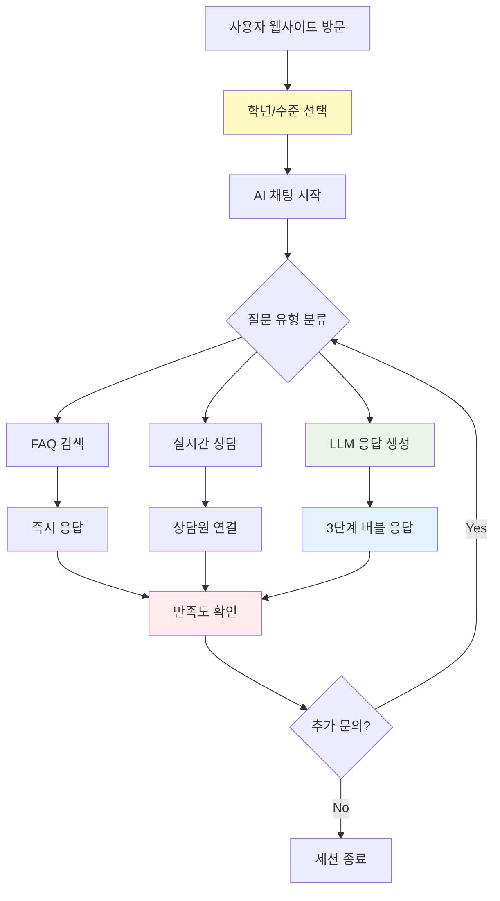
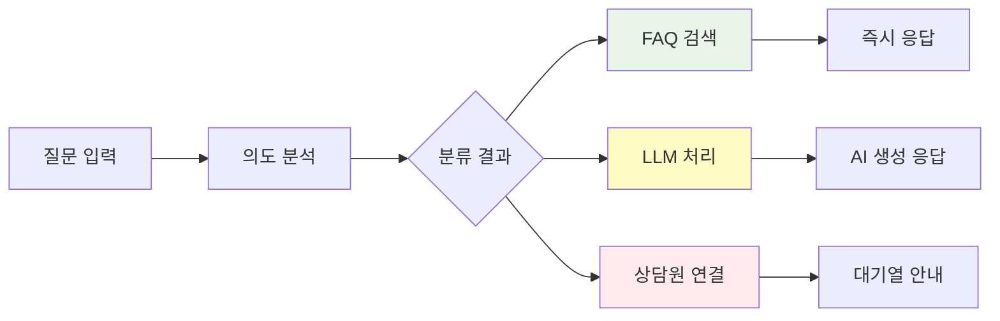

# 고객 서비스 워크플로우

## 개요

AI Navi 고객 서비스 시스템의 전체 워크플로우와 사용자 여정을 정의합니다. 실제 고객 상담 시나리오와 Notion에서 정의한 CS bot MVP 요구사항을 바탕으로 체계적인 서비스 플로우를 구성합니다.

## 1. 전체 서비스 아키텍처



## 2. 사용자 여정 (User Journey)

### 2.1 신규 방문자 플로우

#### 단계 1: 진입 및 온보딩
```typescript
// 진입 시 필수 정보 수집
interface UserOnboarding {
  grade: '中学生' | '高校生' | '浪人生' | '保護者';
  purpose: '受験相談' | '授業内容' | '料金문의' | '기타';
  urgency: 'high' | 'medium' | 'low';
}

const onboardingFlow = [
  {
    step: 1,
    title: '学年を選択してください',
    required: true,
    options: ['中学生', '高校生', '浪人生', '保護者']
  },
  {
    step: 2,
    title: '何についてお聞きしたいですか？',
    required: false,
    options: ['受験相談', '授業内容', '料金문의', '기타']
  }
];
```

#### 단계 2: 개인화된 환영 메시지
```typescript
// 학년별 맞춤 환영 메시지
const welcomeMessages = {
  '中学生': {
    main: 'こんにちは！中学生向けの進学サポートについてお答えします 📚',
    sub: '定期テスト対策から高校受験まで、どんなことでもお気軽にご質問ください。',
    cta: '人気の質問を見る'
  },
  '高校生': {
    main: '大学受験のプロがお答えします！何でもご相談ください 🎯',
    sub: '志望校選びから学習計画まで、一人ひとりに合わせたアドバイスをします。',
    cta: '受験相談を始める'
  },
  '保護者': {
    main: 'お子様の進路についてサポートいたします 👨‍👩‍👧‍👦',
    sub: '費用や学習環境など、保護者様のご不安にお答えします。',
    cta: '料金について質問する'
  }
};
```

### 2.2 기존 사용자 플로우

#### 재방문 사용자 인식
```typescript
// localStorage 기반 사용자 정보 보존
interface ReturnUserData {
  lastGrade: Grade;
  previousQuestions: string[];
  lastVisit: Date;
  preferences: {
    responseSpeed: 'fast' | 'detailed';
    language: 'ja' | 'ko';
  };
}

const returnUserGreeting = (userData: ReturnUserData) => {
  return {
    main: `お帰りなさい！前回は${userData.lastGrade}で相談いただきましたね 😊`,
    sub: '今日はどのようなことをお聞きしたいですか？',
    cta: '前回の続きから'
  };
};
```

## 3. 질문 분류 및 처리 시스템

### 3.1 자동 질문 분류

```typescript
// AI 기반 질문 의도 분류
interface QuestionClassification {
  category: 'academic' | 'admission' | 'fee' | 'facility' | 'schedule' | 'other';
  priority: 'urgent' | 'normal' | 'low';
  complexity: 'simple' | 'moderate' | 'complex';
  requiresHuman: boolean;
}

const classifyQuestion = async (question: string, userGrade: Grade): Promise<QuestionClassification> => {
  // LLM을 통한 질문 분석
  const response = await analyzeQuestionIntent(question, userGrade);
  
  return {
    category: response.category,
    priority: response.urgency === 'high' ? 'urgent' : 'normal',
    complexity: response.complexity,
    requiresHuman: response.complexity === 'complex' || response.category === 'admission'
  };
};
```

### 3.2 응답 라우팅



## 4. 응답 생성 프로세스

### 4.1 3단계 버블 응답 구조

```typescript
// Notion 정책 기반 응답 구조
interface ResponseStructure {
  main: {
    purpose: '핵심 답변';
    style: '직접적이고 명확한 답변';
    length: '1-2문장';
  };
  sub: {
    purpose: '보충 설명';
    style: '친근하고 상세한 설명';
    length: '2-3문장';
  };
  cta: {
    purpose: '행동 유도';
    style: '구체적인 다음 단계 제시';
    format: '버튼 또는 링크';
  };
}

// 실제 응답 생성 예시
const generateResponse = async (question: string, classification: QuestionClassification) => {
  const response = await llmService.generateResponse({
    question,
    classification,
    template: 'three_bubble_structure'
  });

  return {
    response: [
      {
        type: 'main',
        text: response.main,
        style: 'emphasized'
      },
      {
        type: 'sub', 
        text: response.sub,
        style: 'normal'
      },
      {
        type: 'cta',
        text: response.cta,
        style: 'button',
        action: response.action
      }
    ]
  };
};
```

### 4.2 학년별 응답 맞춤화

```typescript
// 학년별 응답 톤앤매너
const responseStyles = {
  '中学生': {
    tone: '친근하고 격려하는',
    vocabulary: '쉬운 용어 사용',
    examples: '구체적인 학습 방법 제시',
    focus: '기초 학습 및 고교 준비'
  },
  '高校生': {
    tone: '전문적이고 실용적인',
    vocabulary: '수험 전문 용어 포함',
    examples: '입시 전략 및 사례 제시',
    focus: '대학 입시 및 진로 상담'
  },
  '保護者': {
    tone: '정중하고 신뢰할 수 있는',
    vocabulary: '정확한 정보 제공',
    examples: '비용 및 제도 설명',
    focus: '자녀 교육 및 학원 시스템'
  }
};
```

## 5. 에러 및 예외 상황 처리

### 5.1 시스템 에러 대응

```typescript
// 에러 시나리오별 대응 방안
const errorRecoveryFlow = {
  llm_timeout: {
    message: '申し訳ございません。少し時間がかかっています。',
    action: 'retry_with_fallback',
    fallback: 'faq_search'
  },
  network_error: {
    message: 'インターネット接続を確認してください 🌐',
    action: 'show_retry_button',
    alternative: 'phone_contact_info'
  },
  service_unavailable: {
    message: '一時的にサービスが利用できません。',
    action: 'show_alternative_contact',
    escalation: 'human_agent'
  }
};
```

### 5.2 사용자 혼란 상황 대응

```typescript
// 애매한 질문 처리
const clarificationFlow = {
  ambiguous_question: {
    response: {
      main: 'もう少し詳しく教えていただけますか？',
      sub: 'より正確にお答えするために、具体的な状況を教えてください。',
      cta: '詳しく質問する'
    },
    suggestions: [
      '具体的な科目について',
      '現在の学年について', 
      '希望する進路について'
    ]
  }
};
```

## 6. 상담원 연결 프로세스

### 6.1 에스컬레이션 조건

```typescript
// 상담원 연결이 필요한 상황
const escalationTriggers = {
  complex_admission_counseling: {
    condition: '개별 입시 상담 요청',
    waitTime: '평균 5분',
    preparation: '기본 정보 사전 수집'
  },
  sensitive_fee_discussion: {
    condition: '할인 또는 특별 요금 문의',
    waitTime: '평균 3분',
    preparation: '현재 프로모션 정보 제공'
  },
  complaint_handling: {
    condition: '불만 또는 클레임',
    waitTime: '즉시',
    preparation: '관리자 직접 연결'
  }
};
```

### 6.2 대기열 관리

```typescript
// 상담 대기열 시스템
interface QueueSystem {
  currentWaitTime: number;
  queuePosition: number;
  estimatedStartTime: Date;
  keepAliveInterval: number;
}

const queueNotification = (queueData: QueueSystem) => {
  return {
    main: `현재 ${queueData.queuePosition}번째로 대기 중입니다`,
    sub: `예상 대기시간: ${queueData.currentWaitTime}분`,
    cta: '대기하면서 FAQ 보기'
  };
};
```

## 7. 만족도 및 피드백 수집

### 7.1 세션 종료 시 피드백

```typescript
// 상담 만족도 조사
interface FeedbackCollection {
  satisfaction: 1 | 2 | 3 | 4 | 5;
  resolved: boolean;
  responseQuality: 'excellent' | 'good' | 'average' | 'poor';
  suggestions?: string;
}

const feedbackFlow = {
  satisfaction_survey: {
    question: '오늘 상담이 도움이 되었나요?',
    options: ['매우 만족', '만족', '보통', '불만족', '매우 불만족'],
    followUp: {
      positive: '감사합니다! 더 궁금한 것이 있으시면 언제든 문의해주세요.',
      negative: '죄송합니다. 어떤 부분이 아쉬우셨는지 알려주시겠어요?'
    }
  }
};
```

### 7.2 지속적 개선 프로세스

```typescript
// 피드백 기반 서비스 개선
interface ImprovementMetrics {
  averageResolutionTime: number;
  firstContactResolutionRate: number;
  customerSatisfactionScore: number;
  escalationRate: number;
}

const improvementActions = {
  low_satisfaction: {
    threshold: 3.0,
    actions: [
      'LLM 프롬프트 개선',
      'FAQ 내용 업데이트',
      '상담원 교육 강화'
    ]
  },
  high_escalation: {
    threshold: 0.3,
    actions: [
      'AI 응답 정확도 향상',
      '사전 정보 수집 개선',
      '셀프 서비스 옵션 확대'
    ]
  }
};
```

## 8. 다국어 지원 워크플로우

### 8.1 언어 감지 및 전환

```typescript
// 자동 언어 감지
const languageDetection = {
  automatic: {
    method: 'llm_based_detection',
    confidence_threshold: 0.8,
    fallback: 'user_selection'
  },
  manual: {
    trigger: '언어 변경 요청',
    options: ['日本語', '한국어', 'English'],
    persistence: 'session_storage'
  }
};
```

### 8.2 언어별 응답 스타일

```typescript
// 언어별 문화적 적응
const culturalAdaptation = {
  japanese: {
    politeness: 'high',
    directness: 'moderate',
    honorifics: 'required',
    examples: '일본 입시 제도 기준'
  },
  korean: {
    politeness: 'high',
    directness: 'high',
    honorifics: 'situational',
    examples: '한국 교육 제도 참조'
  },
  english: {
    politeness: 'moderate',
    directness: 'high',
    honorifics: 'minimal',
    examples: '국제적 관점 제공'
  }
};
```

## 9. 성능 모니터링 및 최적화

### 9.1 핵심 성능 지표

```typescript
// 실시간 모니터링 대상
interface PerformanceMetrics {
  averageResponseTime: number;    // 평균 응답 시간
  concurrentUsers: number;        // 동시 사용자 수
  successRate: number;           // 성공적인 응답 비율
  errorRate: number;             // 에러 발생률
  userSatisfaction: number;      // 사용자 만족도
}

const performanceThresholds = {
  response_time: {
    target: 3000,    // 3초
    warning: 5000,   // 5초
    critical: 10000  // 10초
  },
  success_rate: {
    target: 0.98,    // 98%
    warning: 0.95,   // 95%
    critical: 0.90   // 90%
  }
};
```

### 9.2 자동 최적화

```typescript
// 성능 기반 자동 조정
const autoOptimization = {
  high_load_response: {
    trigger: 'concurrent_users > 500',
    actions: [
      'FAQ 우선 응답',
      'LLM 응답 간소화',
      '캐시 적극 활용'
    ]
  },
  low_satisfaction: {
    trigger: 'satisfaction < 3.5',
    actions: [
      '상담원 연결 우선 제안',
      '응답 품질 강화 모드',
      '추가 정보 수집'
    ]
  }
};
```

## 10. 보안 및 개인정보 보호

### 10.1 데이터 보호 조치

```typescript
// 개인정보 처리 정책
const privacyProtection = {
  data_masking: {
    phone_numbers: 'XXX-XXXX-1234',
    email_addresses: 'user***@domain.com',
    names: '김○○'
  },
  retention_policy: {
    chat_logs: '30일 보관 후 익명화',
    personal_info: '목적 달성 시 즉시 삭제',
    analytics_data: '익명화 후 1년 보관'
  }
};
```

### 10.2 보안 인시던트 대응

```typescript
// 보안 위협 감지 및 대응
const securityResponse = {
  suspicious_activity: {
    detection: [
      '비정상적 질문 패턴',
      '시스템 명령어 포함',
      '과도한 요청 빈도'
    ],
    response: [
      '세션 일시 중단',
      '관리자 알림',
      'IP 기반 제한'
    ]
  }
};
```

## 관련 문서

- [LLM 통합 배경 및 요구사항](llm-integration-context.md)
- [도메인 용어 사전](domain-glossary.md)
- [AI Navi Chatbot 답변 생성 정책 (Notion)](https://www.notion.so/23445c9756f8806c944dd386622577c0)
- [CS bot MVP (Notion)](https://www.notion.so/CS-bot-MVP-abc123def456)

## 최종 업데이트
2025-07-26 - 초기 문서 작성

---

**작성자**: Customer Service Team & Frontend Development Team