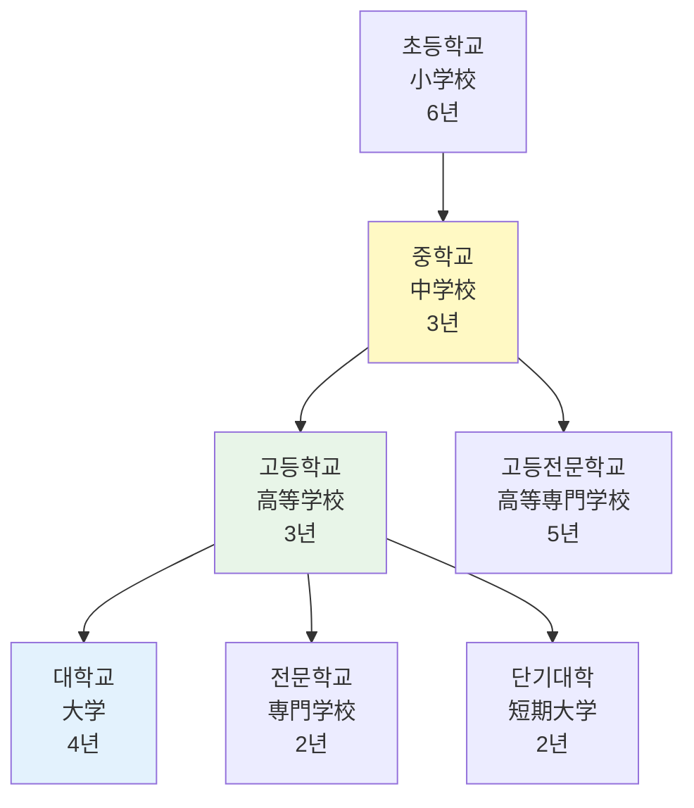

# 학년별 교육 시스템 배경

## 개요

일본 교육 시스템의 학년별 특성과 AI Navi 서비스에서 이를 어떻게 반영하는지에 대한 배경 정보를 제공합니다. GitHub 이슈 #29, #32에서 구현된 학년별 동적 질문 표시와 우선순위 기능의 이론적 근거를 설명합니다.

## 1. 일본 교육 시스템 구조

### 1.1 학제 구분



### 1.2 학년별 주요 특징

#### 중학생 (中学生)
```typescript
interface MiddleSchoolCharacteristics {
  academicFocus: [
    '기초 학력 정착',
    '학습 습관 형성',
    '진로 탐색 시작'
  ];
  commonConcerns: [
    '정기 시험 대비',
    '내신 성적 관리',
    '고교 진학 준비',
    '학습 방법 습득'
  ];
  parentalConcerns: [
    '학습 습관 형성',
    '진로 방향성',
    '학원 선택 기준',
    '비용 대비 효과'
  ];
  serviceApproach: {
    tone: '격려와 동기부여 중심',
    content: '기초 개념 위주의 쉬운 설명',
    examples: '구체적이고 실용적인 학습법'
  };
}
```

#### 고등학생 (高校生)
```typescript
interface HighSchoolCharacteristics {
  academicFocus: [
    '대학 입시 준비',
    '전문 과목 심화',
    '진로 구체화'
  ];
  commonConcerns: [
    '대학 입시 전략',
    '모의고사 성적 향상',
    '전형별 준비 방법',
    '학습 시간 관리'
  ];
  parentalConcerns: [
    '입시 정보 수집',
    '진로 상담',
    '학원비 부담',
    '자녀 스트레스 관리'
  ];
  serviceApproach: {
    tone: '전문적이고 체계적인 조언',
    content: '입시 전략과 구체적 방법론',
    examples: '실제 합격 사례와 통계'
  };
}
```

#### 재수생 (浪人生)
```typescript
interface RoninCharacteristics {
  academicFocus: [
    '재시험 전략 수립',
    '약점 보완',
    '멘탈 관리'
  ];
  commonConcerns: [
    '효과적인 재수 계획',
    '모티베이션 유지',
    '학습 환경 선택',
    '시간 관리 최적화'
  ];
  parentalConcerns: [
    '재수 성공 가능성',
    '정신적 지원 방법',
    '경제적 부담',
    '미래 계획 수립'
  ];
  serviceApproach: {
    tone: '현실적이고 격려적인 조언',
    content: '재수 성공 전략과 케이스 스터디',
    examples: '재수 성공 사례와 실패 요인 분석'
  };
}
```

## 2. 학년별 질문 카테고리 체계

### 2.1 중학생 중심 질문 체계

```typescript
// 실제 구현에서 사용되는 중학생 질문 구조
const MIDDLE_SCHOOL_CATEGORIES = {
  '授業・カリキュラム': {
    priority: 'high',
    questions: [
      '定期テスト対策はしてもらえますか？',
      '学校の教科書に合わせた授業ですか？',
      '補習授業はありますか？',
      '宿題のサポートはありますか？'
    ],
    background: '중학생은 기초 학력 정착이 가장 중요한 시기'
  },
  '進路・高校受験': {
    priority: 'medium',
    questions: [
      '高校受験の準備はいつから始めますか？',
      '内申点を上げる方法を教えてください',
      '志望校選びのアドバイスをもらえますか？'
    ],
    background: '고교 진학에 대한 막연한 불안감 해소가 필요'
  },
  '学習方法・習慣': {
    priority: 'high',
    questions: [
      '効果的な勉強方法を教えてください',
      '集中して勉強する方法は？',
      '部活と勉強の両立はできますか？'
    ],
    background: '올바른 학습 습관 형성이 향후 성공의 기반'
  }
};
```

### 2.2 고등학생 중심 질문 체계

```typescript
// 고등학생의 복잡한 입시 요구사항 반영
const HIGH_SCHOOL_CATEGORIES = {
  '大学受験対策': {
    priority: 'high',
    questions: [
      '難関大学向けの指導はありますか？',
      '共通テスト対策はどうしていますか？',
      '二次試験対策の特別講座はありますか？',
      '推薦入試の準備もできますか？'
    ],
    background: '대학 입시가 최우선 관심사'
  },
  '科目別対策': {
    priority: 'high',
    questions: [
      '数学の応用問題対策を教えてください',
      '英語のリスニング強化方法は？',
      '理科の実験対策はありますか？',
      '国語の現代文読解のコツは？'
    ],
    background: '과목별 전문적 대응이 필요한 시기'
  },
  '進路相談': {
    priority: 'medium',
    questions: [
      '文系と理系の選択について相談したい',
      '将来の職業と関連した学部選びは？',
      '大学のレベル別 対策方法は？'
    ],
    background: '구체적인 진로 설정이 시급한 시기'
  }
};
```

### 2.3 보호자 관점 질문 체계

```typescript
// 보호자의 관심사와 우려사항 반영
const PARENT_CATEGORIES = {
  '料金・制度': {
    priority: 'high',
    questions: [
      '月謝はどのくらいかかりますか？',
      '入塾金や教材費は別途かかりますか？',
      '兄弟割引はありますか？',
      '途中退塾時の返金制度は？'
    ],
    background: '경제적 부담에 대한 명확한 정보 필요'
  },
  '子どもの学習状況': {
    priority: 'high',
    questions: [
      '子どもの成績向上を確認する方法は？',
      '家庭での学習指導方法を教えてください',
      '子どものやる気を引き出す方法は？',
      '学習の進捗状況を把握できますか？'
    ],
    background: '자녀의 학습 상황에 대한 투명한 정보 제공 필요'
  },
  '安全・環境': {
    priority: 'medium',
    questions: [
      '通塾時の安全対策はありますか？',
      '自習室の利用環境は？',
      'コロナ対策はどうしていますか？',
      '送迎サービスはありますか？'
    ],
    background: '자녀의 안전과 학습 환경에 대한 관심'
  }
};
```

## 3. 학년별 서비스 차별화 전략

### 3.1 컨텐츠 맞춤화

```typescript
// 학년별 콘텐츠 차별화 매트릭스
const ContentPersonalization = {
  language_level: {
    '中学生': 'simplified',     // 쉬운 표현 사용
    '高校生': 'standard',       // 표준적인 설명
    '浪人生': 'advanced',       // 전문적인 용어 포함
    '保護者': 'formal'          // 정중하고 정확한 표현
  },
  
  information_depth: {
    '中学生': 'basic',          // 기본적인 정보
    '高校生': 'detailed',       // 상세한 정보
    '浪人生': 'comprehensive',  // 포괄적인 정보
    '保護者': 'practical'       // 실용적인 정보
  },
  
  response_style: {
    '中学生': 'encouraging',    // 격려 중심
    '高校生': 'strategic',      // 전략 중심
    '浪人生': 'realistic',      // 현실적 조언
    '保護者': 'informative'     // 정보 제공 중심
  }
};
```

### 3.2 UI/UX 차별화

```typescript
// 학년별 인터페이스 조정
const InterfaceAdaptation = {
  color_scheme: {
    '中学生': {
      primary: '#4CAF50',      // 친근한 녹색
      accent: '#FFC107',       // 활기찬 노란색
      mood: 'friendly'
    },
    '高校生': {
      primary: '#2196F3',      // 전문적인 파란색
      accent: '#FF5722',       // 긴장감 있는 주황색
      mood: 'focused'
    },
    '保護者': {
      primary: '#607D8B',      // 신뢰감 있는 회색
      accent: '#795548',       // 안정적인 갈색
      mood: 'trustworthy'
    }
  },
  
  information_density: {
    '中学生': 'low',           // 간결한 정보
    '高校生': 'high',          // 많은 정보
    '保護者': 'medium'         // 적절한 양의 정보
  }
};
```

## 4. 입시 제도별 특성 이해

### 4.1 대학 입시 제도 변화

```typescript
// 최신 입시 제도 반영
const AdmissionSystem = {
  共通テスト: {
    subjects: ['国語', '数学', '英語', '理科', '社会'],
    changes: '2021년부터 센터시험 대체',
    importance: '국공립대 및 사립대 기준점수',
    student_concerns: [
      '과목별 배점 비중',
      '난이도 변화 대응',
      '사설 모의고사와의 차이점'
    ]
  },
  
  推薦入試: {
    types: ['학교 추천', '자기 추천', 'AO입시'],
    trend: '전형 비율 지속 증가',
    requirements: ['내신 성적', '활동 내역', '면접'],
    student_concerns: [
      '추천서 작성 요령',
      '포트폴리오 구성',
      '면접 준비 방법'
    ]
  },
  
  一般入試: {
    format: '대학별 개별 시험',
    preparation: '과목별 심화 학습 필요',
    timing: '1-3월 집중',
    student_concerns: [
      '과목별 출제 경향',
      '난이도 예측',
      '시간 배분 전략'
    ]
  }
};
```

### 4.2 학습 단계별 중요성

```typescript
// 학년별 학습 우선순위 매트릭스
const LearningPriorities = {
  '中学1年': {
    focus: '학습 습관 형성',
    subjects: ['수학 기초', '영어 기초', '국어 독해'],
    goals: ['정기시험 80점 이상', '학습 리듬 만들기'],
    common_issues: ['소학교와의 차이 적응', '학습량 증가 대응']
  },
  
  '中学2年': {
    focus: '심화 학습 시작',
    subjects: ['수학 응용', '영어 문법', '이과 기초'],
    goals: ['내신 성적 안정화', '고교 준비'],
    common_issues: ['중2병', '학습 동기 저하']
  },
  
  '中学3年': {
    focus: '고교 입시 준비',
    subjects: ['입시 수학', '영어 독해', '면접 준비'],
    goals: ['희망 고교 합격', '기초 실력 완성'],
    common_issues: ['입시 스트레스', '진로 결정']
  },
  
  '高校1年': {
    focus: '문이과 선택 준비',
    subjects: ['공통 교과목', '진로 탐색'],
    goals: ['내신 관리', '문이과 결정'],
    common_issues: ['중학교와의 차이', '학습량 급증']
  },
  
  '高校2年': {
    focus: '대학 입시 기초',
    subjects: ['선택 과목 집중', '입시 정보 수집'],
    goals: ['모의고사 성적 향상', '목표 대학 설정'],
    common_issues: ['학습 압박감 증가', '진로 고민']
  },
  
  '高校3年': {
    focus: '대학 입시 최종 준비',
    subjects: ['입시 과목 완성', '면접 준비'],
    goals: ['목표 대학 합격', '수험 관리'],
    common_issues: ['극심한 스트레스', '체력 관리']
  }
};
```

## 5. 지역별 교육 특성

### 5.1 수도권 vs 지방 차이

```typescript
// 지역별 교육 환경 차이점
const RegionalDifferences = {
  metropolitan: {
    characteristics: [
      '치열한 경쟁 환경',
      '다양한 교육 기관',
      '정보 접근성 높음',
      '사교육비 부담 높음'
    ],
    student_concerns: [
      '상위권 대학 경쟁',
      '사교육 선택 고민',
      '정보 과부하'
    ],
    service_approach: '차별화된 고급 서비스'
  },
  
  rural: {
    characteristics: [
      '상대적으로 여유로운 환경',
      '제한적인 교육 자원',
      '정보 접근 어려움',
      '거리적 제약'
    ],
    student_concerns: [
      '교육 격차 걱정',
      '진로 정보 부족',
      '학원 선택지 제한'
    ],
    service_approach: '기본에 충실한 실용적 서비스'
  }
};
```

### 5.2 온라인 교육 수요 증가

```typescript
// 코로나19 이후 교육 환경 변화
const EducationTrendChanges = {
  online_learning: {
    growth_rate: '300% 증가 (2020-2022)',
    advantages: [
      '시간과 장소의 자유',
      '반복 학습 가능',
      '비용 효율성',
      '개인 맞춤형 학습'
    ],
    challenges: [
      '집중력 유지 어려움',
      '즉시 질문 어려움',
      '동기 부여 부족',
      '기술적 문제'
    ]
  },
  
  hybrid_learning: {
    trend: '온오프라인 결합 형태 선호',
    optimal_ratio: '오프라인 70% + 온라인 30%',
    student_preference: [
      '핵심 과목은 오프라인',
      '보충 학습은 온라인',
      '질문 답변은 실시간'
    ]
  }
};
```

## 6. 심리적·발달적 특성 고려

### 6.1 연령별 심리 특성

```typescript
// 연령대별 심리적 특성 반영
const PsychologicalTraits = {
  '中学生': {
    developmental_stage: '정체성 형성기',
    characteristics: [
      '또래 집단 영향 강함',
      '자아 탐색 시기',
      '감정 기복 심함',
      '독립성 추구'
    ],
    communication_style: [
      '친근하고 격려적인 톤',
      '구체적인 예시 제공',
      '단계별 설명',
      '성취감 부여'
    ]
  },
  
  '高校生': {
    developmental_stage: '진로 결정기',
    characteristics: [
      '미래에 대한 불안',
      '현실적 사고 증가',
      '책임감 발달',
      '경쟁 의식 강화'
    ],
    communication_style: [
      '전문적이고 신뢰할 수 있는 정보',
      '데이터 기반 설명',
      '다양한 선택지 제시',
      '장기적 관점 제공'
    ]
  },
  
  '保護者': {
    psychological_state: '자녀 교육 불안',
    characteristics: [
      '정보 갈증',
      '경제적 부담 걱정',
      '자녀 미래 걱정',
      '타인과의 비교'
    ],
    communication_style: [
      '정확하고 투명한 정보',
      '구체적인 비용 제시',
      '성공 사례 공유',
      '정기적인 상황 보고'
    ]
  }
};
```

### 6.2 학습 동기 유발 전략

```typescript
// 학년별 동기 부여 방법
const MotivationStrategies = {
  intrinsic_motivation: {
    '中学生': [
      '학습 자체의 즐거움 강조',
      '개인별 성장 추적',
      '단기 목표 설정',
      '다양한 학습 방법 제시'
    ],
    '高校生': [
      '미래 목표와 연결',
      '자기주도 학습 유도',
      '깊이 있는 이해 추구',
      '창의적 사고 개발'
    ]
  },
  
  extrinsic_motivation: {
    '中学生': [
      '성적 향상 가시화',
      '작은 성취 인정',
      '또래와의 건전한 경쟁',
      '보상 시스템 활용'
    ],
    '高校生': [
      '대학 입시 목표 명확화',
      '장기적 성과 추적',
      '사회적 인정 추구',
      '미래 비전 구체화'
    ]
  }
};
```

## 7. 실제 서비스 적용 사례

### 7.1 GitHub 이슈 #29 해결 과정

```typescript
// 학년별 동적 질문 표시 구현
const DynamicQuestionImplementation = {
  problem_analysis: [
    '학년별로 관심사가 다름',
    '일률적인 질문 제시의 한계',
    '사용자 만족도 저하'
  ],
  
  solution_approach: [
    '학년 선택을 우선 조건으로 설정',
    '학년별 질문 카테고리 세분화',
    '우선순위 기반 질문 정렬',
    '동적 UI 구성'
  ],
  
  implementation_details: {
    data_structure: 'GRADE_QUESTIONS 상수',
    ui_component: 'TopQuestions.tsx',
    logic: '학년별 필터링 + 카테고리별 분류',
    user_experience: '직관적인 선택 인터페이스'
  }
};
```

### 7.2 GitHub 이슈 #32 해결 배경

```typescript
// 학년 선택 우선순위 구현 이유
const GradePriorityRationale = {
  educational_background: [
    '일본 교육 시스템의 학년별 특성화',
    '학년별 서로 다른 관심사와 우선순위',
    '효과적인 상담을 위한 사전 정보 필요성'
  ],
  
  user_experience_improvement: [
    '불필요한 정보 필터링',
    '맞춤형 서비스 제공',
    '사용자 플로우 명확화',
    '상담 효율성 증대'
  ],
  
  business_impact: [
    '고객 만족도 향상',
    '상담 품질 개선',
    '서비스 차별화',
    '고객 유지율 증가'
  ]
};
```

## 8. 향후 개선 방향

### 8.1 개인화 수준 향상

```typescript
// 학년을 넘어선 개인화 전략
const PersonalizationEvolution = {
  current_level: '학년별 기본 분류',
  
  next_level: {
    academic_performance: '성적 구간별 맞춤',
    learning_style: '학습 스타일별 대응',
    personality: '성격 유형별 접근',
    family_situation: '가정 환경 고려'
  },
  
  future_vision: {
    ai_tutoring: 'AI 개인교사 시스템',
    predictive_guidance: '예측 기반 진로 안내',
    emotional_support: '정서적 지원 시스템',
    parent_collaboration: '학부모 협력 플랫폼'
  }
};
```

### 8.2 데이터 기반 최적화

```typescript
// 학년별 서비스 최적화 지표
const OptimizationMetrics = {
  effectiveness_indicators: [
    '학년별 문의 해결률',
    '재문의 비율',
    '만족도 점수',
    '서비스 이용 지속률'
  ],
  
  improvement_areas: [
    '질문 카테고리 정교화',
    '응답 품질 향상',
    '개인화 수준 증대',
    '예측 정확도 개선'
  ],
  
  success_criteria: {
    resolution_rate: '95% 이상',
    satisfaction_score: '4.5/5.0 이상',
    retention_rate: '80% 이상',
    response_accuracy: '90% 이상'
  }
};
```

## 관련 문서

- [고객 서비스 워크플로우](customer-service-workflow.md)
- [도메인 용어 사전](domain-glossary.md)
- [MeetA Development Concept (Notion)](https://www.notion.so/23845c9756f8805baf14efeaae60febf)
- [AI Navi 용어집 (Notion)](https://www.notion.so/AI-Navi-abc123def456)

## 최종 업데이트
2025-07-26 - 초기 문서 작성

---

**작성자**: Education Research Team & Frontend Development Team