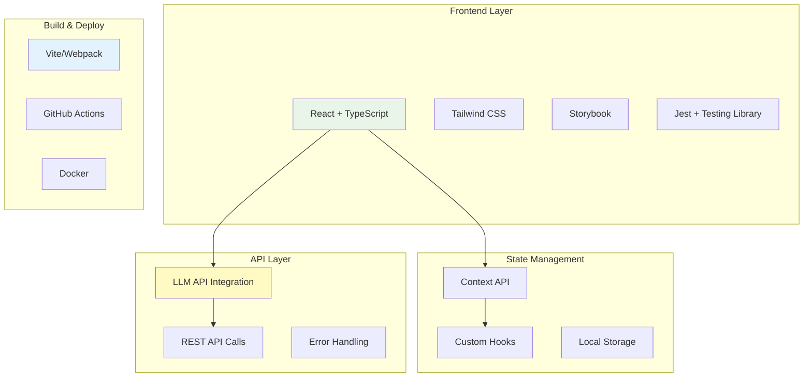

# 기술 아키텍처 개요

## 개요

AI Navi 아웃바운드 CS 314 커뮤니티 프론트엔드의 전체 기술 아키텍처와 설계 철학을 설명합니다. MeetA Development Concept의 ABCD 원칙(AI Driven, Behavior Driven, Component Driven, Domain Driven)을 바탕으로 구축된 현대적인 웹 애플리케이션 아키텍처입니다.

## 1. 전체 시스템 아키텍처



## 2. MeetA ABCD 개발 원칙 적용

### 2.1 AI Driven Development

#### LLM 통합 아키텍처
```typescript
// AI 기반 응답 생성 시스템
interface AIIntegration {
  llmService: {
    provider: 'OpenAI' | 'Claude' | 'Custom';
    model: string;
    configuration: LLMConfig;
  };
  
  responseGeneration: {
    structure: 'three_bubble_format';
    personalization: 'grade_based';
    errorHandling: 'graceful_degradation';
  };
  
  qualityAssurance: {
    responseValidation: boolean;
    contentFiltering: boolean;
    performanceMonitoring: boolean;
  };
}

// 실제 구현에서의 AI 서비스 추상화
abstract class AIService {
  abstract generateResponse(
    prompt: string, 
    context: UserContext
  ): Promise<LLMResponse>;
  
  abstract validateResponse(response: LLMResponse): boolean;
  abstract handleError(error: AIError): ErrorResponse;
}
```

#### AI 기반 의사결정 지원
```typescript
// 사용자 의도 분석 및 자동 라우팅
interface AIDecisionSupport {
  intentAnalysis: {
    classifier: 'question_type_classifier';
    confidence_threshold: 0.8;
    fallback_strategy: 'human_escalation';
  };
  
  contentPersonalization: {
    grade_based_filtering: boolean;
    response_tone_adjustment: boolean;
    complexity_level_adaptation: boolean;
  };
  
  predictiveSupport: {
    next_question_suggestion: boolean;
    user_satisfaction_prediction: boolean;
    escalation_risk_assessment: boolean;
  };
}
```

### 2.2 Behavior Driven Development

#### 사용자 시나리오 기반 설계
```typescript
// BDD 스타일의 사용자 스토리 구현
interface UserBehaviorScenarios {
  gradeSelection: {
    given: 'user visits the website';
    when: 'they need to select their grade';
    then: 'grade selection should be prioritized before any other interaction';
    
    implementation: 'GitHub Issue #32 해결';
  };
  
  questionInteraction: {
    given: 'user has selected their grade';
    when: 'they want to ask a question';
    then: 'relevant grade-specific questions should be displayed';
    
    implementation: 'GitHub Issue #29 해결';
  };
  
  errorRecovery: {
    given: 'LLM service returns an error';
    when: 'user is waiting for a response';
    then: 'friendly error message with retry option should appear';
    
    implementation: 'GitHub Issue #41 해결';
  };
}
```

#### 테스트 주도 개발 구조
```typescript
// BDD 스타일 테스트 구조
describe('User Grade Selection Behavior', () => {
  describe('Given user visits the website', () => {
    describe('When they try to access chat without selecting grade', () => {
      it('Then chat input should be disabled', () => {
        // 테스트 구현
      });
      
      it('Then menu button should be disabled', () => {
        // 테스트 구현  
      });
      
      it('Then helpful placeholder message should be shown', () => {
        // 테스트 구현
      });
    });
  });
});
```

### 2.3 Component Driven Development

#### Atomic Design 아키텍처
```typescript
// 컴포넌트 계층 구조
interface ComponentArchitecture {
  atoms: {
    examples: ['Button', 'Icon', 'Typography', 'Input'];
    responsibility: '기본 UI 요소';
    dependencies: 'none';
    reusability: 'highest';
  };
  
  molecules: {
    examples: ['ChatBubble', 'InputField', 'ErrorMessage'];
    responsibility: 'atoms 조합으로 단일 기능';
    dependencies: 'atoms only';
    reusability: 'high';
  };
  
  organisms: {
    examples: ['ChatInput', 'MenuModal', 'LLMResponseGroup'];
    responsibility: '복잡한 UI 섹션';
    dependencies: 'molecules + atoms';
    reusability: 'medium';
  };
  
  templates: {
    examples: ['ChatLayout', 'MainLayout'];
    responsibility: '페이지 구조 정의';
    dependencies: 'organisms + molecules + atoms';
    reusability: 'low';
  };
}
```

#### 컴포넌트 개발 워크플로우
```typescript
// Storybook 기반 컴포넌트 개발
interface ComponentDevelopmentFlow {
  step1_design: {
    tool: 'Storybook';
    purpose: '독립적인 컴포넌트 개발 및 문서화';
    output: 'Component Stories';
  };
  
  step2_test: {
    tool: 'Jest + Testing Library';
    purpose: '행동 기반 컴포넌트 테스트';
    coverage: 'unit + integration';
  };
  
  step3_integration: {
    tool: 'React + TypeScript';
    purpose: '실제 애플리케이션 통합';
    validation: 'E2E 테스트';
  };
  
  step4_documentation: {
    tool: 'Storybook + MDX';
    purpose: '사용법 및 가이드라인 문서화';
    audience: 'development team';
  };
}
```

### 2.4 Domain Driven Development

#### 도메인 모델링
```typescript
// 교육 도메인 모델
interface EducationDomain {
  entities: {
    Student: {
      grade: Grade;
      academicLevel: AcademicLevel;
      learningStyle: LearningStyle;
      goals: EducationalGoal[];
    };
    
    Question: {
      category: QuestionCategory;
      complexity: ComplexityLevel;
      priority: Priority;
      expectedResponseType: ResponseType;
    };
    
    Response: {
      bubbles: BubbleResponse[];
      personalization: PersonalizationLevel;
      satisfaction: SatisfactionScore;
    };
  };
  
  valueObjects: {
    Grade: '中学生' | '高校生' | '浪人生' | '保護者';
    QuestionCategory: 'academic' | 'admission' | 'fee' | 'facility';
    ResponseType: 'faq' | 'llm' | 'human_agent';
  };
  
  aggregates: {
    ChatSession: {
      root: 'Session';
      entities: ['Student', 'Question[]', 'Response[]'];
      invariants: ['grade_must_be_selected_first'];
    };
  };
}
```

#### 도메인 서비스 계층
```typescript
// 도메인 로직 캡슐화
interface DomainServices {
  gradeCustomizationService: {
    responsibility: '학년별 컨텐츠 맞춤화';
    methods: ['getQuestionsForGrade', 'customizeResponse', 'validateGradeSelection'];
    dependencies: ['GradeRepository', 'QuestionRepository'];
  };
  
  llmIntegrationService: {
    responsibility: 'LLM 응답 생성 및 처리';
    methods: ['generateResponse', 'validateResponse', 'handleErrors'];
    dependencies: ['LLMProvider', 'ResponseValidator'];
  };
  
  userExperienceService: {
    responsibility: '사용자 경험 최적화';
    methods: ['analyzeUserIntent', 'predictNextAction', 'optimizeFlow'];
    dependencies: ['UserBehaviorAnalyzer', 'PersonalizationEngine'];
  };
}
```

## 3. 기술 스택 및 선택 이유

### 3.1 프론트엔드 핵심 기술

#### React + TypeScript
```typescript
// 선택 이유 및 활용 방법
interface ReactTypeScriptRationale {
  선택이유: {
    컴포넌트_재사용성: 'Atomic Design과 완벽한 조화';
    타입_안전성: 'TypeScript로 런타임 에러 방지';
    생태계: '풍부한 라이브러리와 도구';
    팀_숙련도: '개발팀의 기존 경험 활용';
  };
  
  활용방법: {
    함수형_컴포넌트: 'React Hooks 기반 상태 관리';
    엄격한_타이핑: 'interface 기반 props 정의';
    성능_최적화: 'memo, useMemo, useCallback 활용';
    테스트_친화적: 'Testing Library 기반 테스트';
  };
}

// 실제 프로젝트 구조
const ProjectStructure = {
  'src/': {
    'components/': {
      'atoms/': 'Button, Icon, Typography 등',
      'molecules/': 'ChatBubble, InputField 등', 
      'organisms/': 'ChatInput, MenuModal 등',
      'templates/': 'ChatLayout 등'
    },
    'hooks/': 'useGradeCustomization, useChat 등',
    'services/': 'API 통신 및 비즈니스 로직',
    'shared/': '공통 유틸리티 및 상수',
    'types/': 'TypeScript 타입 정의'
  }
};
```

#### Tailwind CSS
```typescript
// Tailwind CSS 선택 이유
interface TailwindRationale {
  장점: {
    유틸리티_퍼스트: '일관된 디자인 시스템 구축';
    반응형_설계: '모바일 퍼스트 접근법';
    커스터마이징: '브랜드 컬러 및 스타일 적용';
    성능: '사용하지 않는 CSS 자동 제거';
  };
  
  프로젝트_적용: {
    디자인_토큰: 'DESIGN_TOKENS 상수로 중앙 관리';
    반응형_패턴: 'sm:, md:, lg: 프리픽스 활용';
    컴포넌트_클래스: '@apply 지시어로 재사용 클래스';
    테마_시스템: '학년별 동적 색상 적용';
  };
}
```

### 3.2 상태 관리 아키텍처

#### Context API + Custom Hooks
```typescript
// 가벼운 상태 관리 패턴
interface StateManagementPattern {
  전역상태: {
    tool: 'React Context API';
    scope: ['selectedGrade', 'userPreferences', 'themeSettings'];
    rationale: '복잡하지 않은 상태이므로 Redux 불필요';
  };
  
  지역상태: {
    tool: 'useState, useReducer';
    scope: ['formInputs', 'modalStates', 'loadingStates'];
    pattern: '컴포넌트별 독립적 관리';
  };
  
  서버상태: {
    tool: 'Custom Hooks';
    pattern: 'useChat, useLLMResponse';
    features: ['캐싱', '에러처리', '재시도'];
  };
}

// 실제 구현 예시
const GradeContext = createContext<{
  selectedGrade: Grade | null;
  setSelectedGrade: (grade: Grade) => void;
  isGradeSelected: boolean;
}>({
  selectedGrade: null,
  setSelectedGrade: () => {},
  isGradeSelected: false
});

export const useGrade = () => {
  const context = useContext(GradeContext);
  if (!context) {
    throw new Error('useGrade must be used within GradeProvider');
  }
  return context;
};
```

### 3.3 API 통신 아키텍처

#### REST API + LLM Integration
```typescript
// API 계층 구조
interface APIArchitecture {
  httpClient: {
    tool: 'fetch API';
    features: ['타임아웃 처리', '에러 처리', '재시도 로직'];
    abstraction: 'service layer로 비즈니스 로직 분리';
  };
  
  llmIntegration: {
    pattern: 'adapter pattern';
    providers: ['OpenAI', 'Claude', 'Custom'];
    features: ['응답 검증', '에러 복구', '성능 모니터링'];
  };
  
  errorHandling: {
    strategy: 'graceful degradation';
    fallbacks: ['cached responses', 'FAQ search', 'human escalation'];
    userExperience: '사용자 친화적 에러 메시지';
  };
}

// 실제 API 서비스 구현
class ChatAPIService {
  async sendMessage(message: string, context: UserContext): Promise<LLMResponse> {
    try {
      const response = await this.httpClient.post('/api/chat', {
        message,
        grade: context.selectedGrade,
        personalization: context.preferences
      });
      
      return this.validateAndTransformResponse(response);
    } catch (error) {
      return this.handleAPIError(error);
    }
  }
  
  private validateAndTransformResponse(response: any): LLMResponse {
    // 응답 검증 및 변환 로직
  }
  
  private handleAPIError(error: any): LLMResponse {
    // 에러 처리 및 폴백 로직
  }
}
```

## 4. 성능 최적화 전략

### 4.1 렌더링 최적화

```typescript
// React 성능 최적화 패턴
interface PerformanceOptimization {
  memoization: {
    React_memo: '컴포넌트 리렌더링 방지';
    useMemo: '비싼 계산 결과 캐싱';
    useCallback: '함수 참조 안정성 보장';
  };
  
  codesplitting: {
    dynamic_imports: 'React.lazy()로 컴포넌트 지연 로딩';
    route_splitting: '페이지별 번들 분할';
    feature_splitting: '기능별 청크 분리';
  };
  
  bundleOptimization: {
    treeShaking: '사용하지 않는 코드 제거';
    minification: '프로덕션 빌드 최적화';
    compression: 'gzip 압축 적용';
  };
}

// 실제 최적화 구현 예시
const MenuModal = memo(({ isOpen, menuConfig }: MenuModalProps) => {
  const memoizedConfig = useMemo(() => 
    processMenuConfig(menuConfig), [menuConfig]
  );
  
  const handleItemClick = useCallback((item: MenuItem) => {
    // 이벤트 핸들러 로직
  }, []);
  
  if (!isOpen) return null; // 조건부 렌더링으로 불필요한 DOM 방지
  
  return (
    <Suspense fallback={<LoadingSpinner />}>
      <LazyMenuContent config={memoizedConfig} onItemClick={handleItemClick} />
    </Suspense>
  );
});
```

### 4.2 네트워크 최적화

```typescript
// API 통신 최적화
interface NetworkOptimization {
  caching: {
    strategy: 'stale-while-revalidate';
    implementation: 'custom hooks with cache';
    duration: 'FAQ: 1시간, 설정: 1일, LLM: 없음';
  };
  
  requestOptimization: {
    debouncing: '사용자 입력 디바운싱 (300ms)';
    batching: '여러 요청 배치 처리';
    prioritization: '중요한 요청 우선 처리';
  };
  
  errorRecovery: {
    retryLogic: '지수 백오프 재시도';
    circuitBreaker: '연속 실패 시 일시 중단';
    fallbackData: '캐시된 데이터 활용';
  };
}
```

## 5. 보안 아키텍처

### 5.1 프론트엔드 보안

```typescript
// 보안 고려사항
interface SecurityMeasures {
  dataProtection: {
    sanitization: '사용자 입력 XSS 방지';
    validation: '클라이언트 사이드 입력 검증';
    encryption: '민감 정보 로컬 암호화';
  };
  
  apiSecurity: {
    authentication: 'JWT 토큰 기반 인증';
    authorization: '역할 기반 접근 제어';
    rateLimit: 'API 호출 빈도 제한';
  };
  
  contentSecurity: {
    csp: 'Content Security Policy 적용';
    httpsOnly: 'HTTPS 강제 리다이렉트';
    secretsManagement: '환경변수 기반 설정 관리';
  };
}

// 보안 유틸리티 구현
class SecurityUtils {
  static sanitizeUserInput(input: string): string {
    return DOMPurify.sanitize(input);
  }
  
  static validateGrade(grade: string): grade is Grade {
    return ['中学生', '高校生', '浪人生', '保護者'].includes(grade);
  }
  
  static encryptLocalData(data: any): string {
    return CryptoJS.AES.encrypt(JSON.stringify(data), SECRET_KEY).toString();
  }
}
```

## 6. 테스트 아키텍처

### 6.1 테스트 피라미드

```typescript
// 테스트 전략
interface TestingStrategy {
  unit_tests: {
    tool: 'Jest + Testing Library';
    coverage: '90% 이상';
    focus: ['컴포넌트 로직', '유틸리티 함수', '훅'];
    pattern: 'BDD 스타일 describe/it';
  };
  
  integration_tests: {
    tool: 'Testing Library';
    coverage: '주요 사용자 플로우';
    focus: ['컴포넌트 상호작용', 'API 통합', '상태 관리'];
    pattern: '사용자 관점의 시나리오 테스트';
  };
  
  e2e_tests: {
    tool: 'Cypress';
    coverage: '핵심 비즈니스 플로우';
    focus: ['전체 사용자 여정', '크로스 브라우저', '반응형'];
    pattern: 'cucumber 스타일 시나리오';
  };
  
  visual_tests: {
    tool: 'Storybook + Chromatic';
    coverage: '모든 컴포넌트 상태';
    focus: ['UI 회귀', '반응형 레이아웃', '브라우저 차이'];
    pattern: '스냅샷 기반 비교';
  };
}
```

### 6.2 품질 보증 자동화

```typescript
// CI/CD 파이프라인
interface QualityAssurance {
  preCommit: {
    linting: 'ESLint + Prettier';
    typeChecking: 'TypeScript 컴파일';
    testing: '변경된 파일 관련 테스트';
  };
  
  pullRequest: {
    fullTestSuite: '전체 테스트 스위트 실행';
    codeReview: '자동 코드 품질 분석';
    visualRegression: 'UI 변경사항 검증';
  };
  
  deployment: {
    stagingTests: '스테이징 환경 통합 테스트';
    performanceTests: 'Lighthouse 성능 측정';
    securityScans: '보안 취약점 스캔';
  };
}
```

## 7. 모니터링 및 관찰성

### 7.1 성능 모니터링

```typescript
// 성능 지표 수집
interface PerformanceMonitoring {
  coreWebVitals: {
    LCP: 'Largest Contentful Paint < 2.5s';
    FID: 'First Input Delay < 100ms';
    CLS: 'Cumulative Layout Shift < 0.1';
  };
  
  userExperience: {
    responseTime: 'LLM 응답 시간 추적';
    errorRate: '에러 발생률 모니터링';
    conversionRate: '사용자 목표 달성률';
  };
  
  technicalMetrics: {
    bundleSize: '번들 크기 변화 추적';
    memoryUsage: '메모리 사용량 모니터링';
    apiLatency: 'API 응답 시간 측정';
  };
}
```

### 7.2 사용자 행동 분석

```typescript
// 사용자 분석 시스템
interface UserAnalytics {
  behaviorTracking: {
    pageViews: '페이지 방문 패턴';
    userFlow: '사용자 여정 분석';
    dropoffPoints: '이탈 지점 식별';
  };
  
  featureUsage: {
    gradeSelection: '학년별 사용 분포';
    questionCategories: '인기 질문 유형';
    responseInteraction: '응답 상호작용 패턴';
  };
  
  satisfactionMetrics: {
    nps: 'Net Promoter Score';
    csat: 'Customer Satisfaction Score';
    taskCompletion: '작업 완료율';
  };
}
```

## 8. 확장성 및 유지보수성

### 8.1 모듈화 전략

```typescript
// 확장 가능한 구조
interface ScalabilityDesign {
  modular_architecture: {
    feature_modules: '기능별 독립적 모듈';
    shared_modules: '공통 기능 재사용';
    plugin_system: '플러그인 기반 확장';
  };
  
  configuration_driven: {
    feature_flags: '기능별 활성화/비활성화';
    theme_system: '동적 테마 변경';
    content_management: '외부 설정 기반 컨텐츠';
  };
  
  api_abstraction: {
    service_interfaces: '서비스 추상화 계층';
    provider_pattern: '다중 서비스 제공자 지원';
    adapter_pattern: '외부 시스템 통합';
  };
}
```

### 8.2 문서화 전략

```typescript
// 문서화 시스템
interface DocumentationStrategy {
  code_documentation: {
    inline_comments: 'JSDoc 기반 함수 문서화';
    readme_files: '모듈별 사용법 가이드';
    architecture_docs: 'ADR 기반 의사결정 기록';
  };
  
  component_documentation: {
    storybook: '컴포넌트 사용법 및 예시';
    design_system: '디자인 토큰 및 가이드라인';
    api_docs: 'TypeScript 인터페이스 문서';
  };
  
  process_documentation: {
    development_guide: '개발 환경 설정 및 워크플로우';
    deployment_guide: '배포 프로세스 및 환경 설정';
    troubleshooting: '일반적인 문제 해결 방법';
  };
}
```

## 9. 미래 확장 계획

### 9.1 기술적 로드맵

```typescript
// 미래 기술 도입 계획
interface TechnicalRoadmap {
  short_term: {
    performance: 'React 18 Concurrent Features 도입';
    testing: 'Playwright E2E 테스트 전환';
    bundling: 'Vite 번들러 도입';
  };
  
  medium_term: {
    architecture: 'Micro Frontend 아키텍처 검토';
    state_management: 'Zustand 또는 Jotai 도입 검토';
    styling: 'CSS-in-JS 라이브러리 도입';
  };
  
  long_term: {
    framework: 'Next.js SSR/SSG 전환 검토';
    mobile: 'React Native 모바일 앱 개발';
    ai_enhancement: '클라이언트 사이드 AI 기능 강화';
  };
}
```

### 9.2 비즈니스 확장 대응

```typescript
// 비즈니스 확장에 따른 기술적 대응
interface BusinessScaling {
  multi_language: {
    i18n: 'react-i18next 기반 국제화';
    rtl_support: 'Right-to-Left 언어 지원';
    cultural_adaptation: '지역별 문화적 맞춤화';
  };
  
  multi_tenant: {
    brand_theming: '브랜드별 테마 시스템';
    feature_customization: '고객별 기능 조정';
    data_isolation: '고객 데이터 격리';
  };
  
  integration_ecosystem: {
    third_party_apis: '외부 서비스 통합 프레임워크';
    webhook_system: '실시간 이벤트 처리';
    plugin_marketplace: '서드파티 플러그인 지원';
  };
}
```

## 관련 문서

- [프론트엔드 컴포넌트 패턴](../rule/frontend-component-patterns.md)
- [사용자 경험 가이드라인](../rule/user-experience-guidelines.md)
- [LLM 통합 배경 및 요구사항](llm-integration-context.md)
- [MeetA Development Concept (Notion)](https://www.notion.so/23845c9756f8805baf14efeaae60febf)

## 최종 업데이트
2025-07-26 - 초기 문서 작성

---

**작성자**: Architecture Team & Frontend Development Team