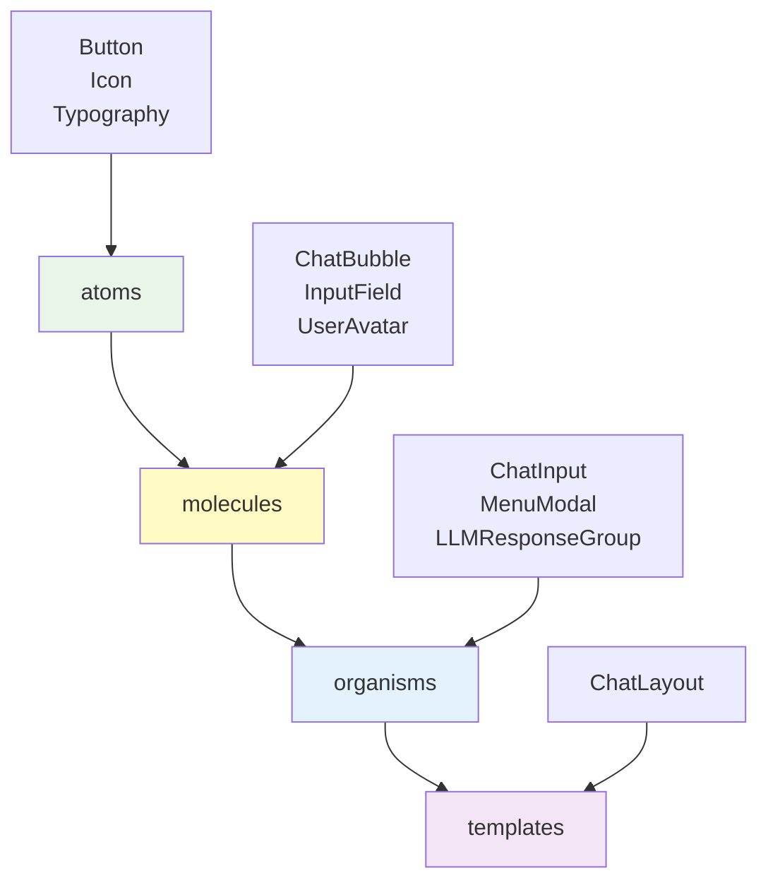

# 프론트엔드 컴포넌트 패턴 가이드

## 개요

AI Navi 프론트엔드에서 사용하는 컴포넌트 패턴과 설계 원칙을 정의합니다. MeetA Development Concept의 **Component Driven Development** 원칙을 따라 일관성 있고 재사용 가능한 컴포넌트를 구축합니다.

## 1. Atomic Design 구조

### 계층별 책임과 역할



#### 🧩 Atoms (원자)
**책임**: 가장 기본적인 UI 요소
- 다른 컴포넌트에 의존하지 않음
- 단일 기능만 수행
- 스타일링과 기본 상호작용만 포함

**실제 구현 예시**:
```typescript
// src/components/atoms/Button/Button.tsx
interface ButtonProps {
  variant: 'primary' | 'secondary' | 'danger';
  size: 'sm' | 'md' | 'lg';
  disabled?: boolean;
  onClick: () => void;
  children: React.ReactNode;
}

export const Button: React.FC<ButtonProps> = ({ 
  variant, size, disabled, onClick, children 
}) => {
  const baseClasses = 'px-4 py-2 rounded-md font-medium transition-colors';
  const variantClasses = {
    primary: 'bg-blue-600 text-white hover:bg-blue-700',
    secondary: 'bg-gray-200 text-gray-800 hover:bg-gray-300',
    danger: 'bg-red-600 text-white hover:bg-red-700'
  };
  
  return (
    <button 
      className={`${baseClasses} ${variantClasses[variant]} ${size === 'sm' ? 'text-sm' : size === 'lg' ? 'text-lg' : ''}`}
      disabled={disabled}
      onClick={onClick}
    >
      {children}
    </button>
  );
};
```

#### 🔗 Molecules (분자)
**책임**: atoms를 조합한 단일 기능 컴포넌트

**실제 구현 예시**:
```typescript
// src/components/molecules/ChatBubble/ChatBubble.tsx
interface ChatBubbleProps {
  type: 'main' | 'sub' | 'cta';
  text: string;
  attachment?: AttachmentData;
  accentColor?: AccentColor;
}

export const ChatBubble: React.FC<ChatBubbleProps> = ({ 
  type, text, attachment, accentColor = 'orange' 
}) => {
  const colors = getColorClasses(accentColor);
  
  return (
    <div className={`p-3 rounded-lg ${colors.bgLight}`}>
      <Typography 
        variant={type === 'main' ? 'body-bold' : 'body'} 
        color={colors.text}
      >
        {text}
      </Typography>
      
      {attachment && (
        <div className="mt-2">
          {attachment.type === 'image' && (
            
          )}
        </div>
      )}
    </div>
  );
};
```

## 2. 실제 GitHub 이슈 해결 패턴

### 이슈 #32: 학년 미선택시 UI 비활성화

**문제 상황**: 학년 선택 전에 메뉴와 입력창이 활성화되어 사용자 플로우가 복잡해짐

**해결 패턴**: 상태 기반 UI 제어

```typescript
// src/components/organisms/ChatInput/ChatInput.tsx
interface ChatInputProps {
  gradeSelected: boolean;
  onSendMessage: (message: string) => void;
  onMenuClick: () => void;
}

export const ChatInput: React.FC<ChatInputProps> = ({ 
  gradeSelected, onSendMessage, onMenuClick 
}) => {
  const [message, setMessage] = useState('');
  const isDisabled = !gradeSelected;
  
  return (
    <div className="flex items-center gap-2 p-4 border-t">
      {/* Menu Button */}
      <Button 
        variant="secondary" 
        size="sm" 
        onClick={onMenuClick}
        disabled={isDisabled}
        aria-label="메뉴 열기"
      >
        <Icon name="menu" size="sm" />
      </Button>
      
      {/* Input Field */}
      <InputField
        value={message}
        onChange={setMessage}
        disabled={isDisabled}
        placeholder={isDisabled ? "학년을 먼저 선택해주세요" : "메시지를 입력하세요"}
      />
      
      <Button 
        variant="primary" 
        size="sm" 
        onClick={() => onSendMessage(message)}
        disabled={isDisabled || !message.trim()}
      >
        <Icon name="send" size="sm" />
      </Button>
    </div>
  );
};
```

**테스트 코드**:
```typescript
// src/components/organisms/ChatInput/ChatInput.test.tsx
describe('ChatInput 학년 선택 상태 테스트', () => {
  test('학년 미선택시 입력창과 메뉴 버튼이 비활성화되어야 함', () => {
    render(
      <ChatInput 
        gradeSelected={false}
        onSendMessage={jest.fn()}
        onMenuClick={jest.fn()}
      />
    );
    
    const inputField = screen.getByRole('textbox');
    const menuButton = screen.getByRole('button', { name: /메뉴 열기/i });
    
    expect(inputField).toBeDisabled();
    expect(menuButton).toBeDisabled();
    expect(inputField).toHaveAttribute('placeholder', '학년을 먼저 선택해주세요');
  });
});
```

### 이슈 #44: PC 환경 반응형 너비 조정

**문제 상황**: PC에서 하단 메뉴와 모달의 너비가 일치하지 않음

**해결 패턴**: Tailwind CSS 반응형 클래스 활용

```typescript
// src/components/organisms/MenuModal/MenuModal.tsx
export const MenuModal: React.FC<MenuModalProps> = ({ 
  isOpen, onClose, menuConfig, accentColor = 'orange' 
}) => {
  const colors = getColorClasses(accentColor);
  
  return (
    <div className="fixed inset-0 z-50 bg-transparent flex items-end justify-center">
      <div
        data-testid="menu-modal"
        className={`
          ${colors.bgLight} shadow-xl
          transform transition-transform duration-300 ease-out
          ${isOpen ? 'translate-y-0' : 'translate-y-full'}
          w-full mx-auto
          sm:w-[500px] sm:max-w-[500px] sm:mb-4
        `}
      >
        {/* 메뉴 내용 */}
      </div>
    </div>
  );
};
```

**테스트 코드**:
```typescript
describe('MenuModal PC 환경 너비 테스트', () => {
  test('PC 환경에서 모달 너비가 500px로 설정되어야 함', () => {
    // PC 환경 시뮬레이션
    Object.defineProperty(window, 'innerWidth', { value: 1024 });
    
    render(<MenuModal isOpen={true} menuConfig={mockConfig} />);
    
    const modal = screen.getByTestId('menu-modal');
    expect(modal).toHaveClass('sm:w-[500px]');
    expect(modal).toHaveClass('sm:max-w-[500px]');
  });
});
```

### 이슈 #41: LLM 에러 처리 개선

**문제 상황**: LLM 응답 실패시 빈 버블이 생성됨

**해결 패턴**: 컴포넌트 레벨 에러 처리

```typescript
// src/components/organisms/LLMResponseGroup/LLMResponseGroup.tsx
interface LLMResponseGroupProps {
  response: LLMResponse;
  accentColor?: AccentColor;
}

export const LLMResponseGroup: React.FC<LLMResponseGroupProps> = ({ 
  response, accentColor = 'orange' 
}) => {
  // 에러 조건 체크
  if (!response || !response.response || response.response.length === 0 || response.status !== 200) {
    return (
      <ChatBubble 
        type="main" 
        text={ERROR_MESSAGES.LLM_TEMPORARY_ERROR}
        accentColor="red" 
      />
    );
  }
  
  return (
    <div className="flex flex-col gap-2">
      {response.response.map((bubble, index) => (
        <ChatBubble 
          key={index}
          type={bubble.type}
          text={bubble.text}
          attachment={bubble.attachment}
          accentColor={accentColor}
        />
      ))}
    </div>
  );
};
```

**에러 메시지 상수화**:
```typescript
// src/shared/constants/errorMessages.ts
export const ERROR_MESSAGES = {
  LLM_TEMPORARY_ERROR: '申し訳ありません😭一時的なエラーが発生しています。一度チャットを閉じてから再度お試しください。'
} as const;
```

### 이슈 #29: 학년별 동적 질문 표시

**문제 상황**: 학년에 따른 질문 내용 동적 변경 필요

**해결 패턴**: 설정 기반 동적 렌더링

```typescript
// src/shared/constants/gradeQuestions.constants.ts
export const GRADE_QUESTIONS = {
  高校生: {
    '授業・カリキュラム': [
      '大学受験対策はどの科目に対応していますか？',
      '難関大学向けの指導はありますか？',
      '定期テスト対策と受験対策は両立できますか？'
    ],
    '通塾・学習時間': [
      '部活と両立できますか？',
      '自習室はいつでも使えますか？'
    ]
  },
  中学生: {
    '授業・カリキュラム': [
      '定期テスト対策はしてもらえますか？',
      '学校の教科書に合わせた授業ですか？'
    ]
  }
} as const;

// src/components/organisms/TopQuestions/TopQuestions.tsx
interface TopQuestionsProps {
  selectedGrade: Grade;
  selectedCategory: string;
  onQuestionClick: (question: string) => void;
}

export const TopQuestions: React.FC<TopQuestionsProps> = ({ 
  selectedGrade, selectedCategory, onQuestionClick 
}) => {
  const questions = GRADE_QUESTIONS[selectedGrade]?.[selectedCategory] || [];
  
  return (
    <div className="grid gap-2">
      {questions.map((question, index) => (
        <Button
          key={index}
          variant="secondary"
          onClick={() => onQuestionClick(question)}
          className="text-left p-3 h-auto whitespace-normal"
        >
          {question}
        </Button>
      ))}
    </div>
  );
};
```

## 3. 컴포넌트 설계 원칙

### 3.1 단일 책임 원칙 (SRP)

```typescript
// ❌ Bad: 여러 책임을 가진 컴포넌트
const ChatComponent = () => {
  // 메시지 관리 + UI 렌더링 + API 호출 + 상태 관리 + 에러 처리
  const [messages, setMessages] = useState([]);
  const [loading, setLoading] = useState(false);
  
  const sendMessage = async (text) => {
    setLoading(true);
    try {
      const response = await fetch('/api/chat', { /*...*/ });
      const data = await response.json();
      setMessages(prev => [...prev, data]);
    } catch (error) {
      // 에러 처리
    }
    setLoading(false);
  };
  
  return (
    <div>
      {/* 복잡한 UI 로직 */}
    </div>
  );
};

// ✅ Good: 책임이 분리된 컴포넌트들
const useChatAPI = () => {
  const sendMessage = useCallback(async (text: string) => {
    // API 로직만
  }, []);
  
  return { sendMessage };
};

const ChatMessages: React.FC<{ messages: Message[] }> = ({ messages }) => {
  // 메시지 렌더링만
  return (
    <div>
      {messages.map(message => (
        <ChatBubble key={message.id} {...message} />
      ))}
    </div>
  );
};

const ChatPage = () => {
  const { messages, sendMessage } = useChatAPI();
  
  return (
    <ChatLayout>
      <ChatMessages messages={messages} />
      <ChatInput onSend={sendMessage} />
    </ChatLayout>
  );
};
```

### 3.2 Props 타입 안전성

```typescript
// ✅ Good: 엄격한 타입 정의
interface ChatBubbleProps {
  // 필수 데이터
  type: 'main' | 'sub' | 'cta';
  text: string;
  
  // 선택적 기능
  attachment?: AttachmentData;
  timestamp?: Date;
  
  // 이벤트 핸들러
  onCTAClick?: () => void;
  
  // 스타일링
  accentColor?: AccentColor;
  className?: string;
}

// ❌ Bad: 불명확한 타입
interface BadProps {
  data: any;
  config: object;
  handlers: any;
}
```

## 4. 성능 최적화 패턴

### 4.1 메모이제이션 활용

```typescript
// ✅ Good: 적절한 메모이제이션
const ChatMessage = memo(({ message, accentColor }: ChatMessageProps) => {
  const colors = useMemo(() => getColorClasses(accentColor), [accentColor]);
  
  const handleCTAClick = useCallback(() => {
    // CTA 클릭 로직
  }, [message.id]);
  
  return (
    <div className={colors.bgLight}>
      <ChatBubble {...message} onCTAClick={handleCTAClick} />
    </div>
  );
});

ChatMessage.displayName = 'ChatMessage';
```

### 4.2 조건부 렌더링 최적화

```typescript
// ✅ Good: 효율적인 조건부 렌더링
const MenuModal = ({ isOpen, menuConfig }) => {
  // 모달이 열릴 때만 DOM에 렌더링
  if (!isOpen) return null;
  
  return (
    <div className="modal-container">
      {/* 모달 내용 */}
    </div>
  );
};

// ✅ Good: 지연 로딩
const MenuModal = lazy(() => import('./MenuModal'));

const App = () => {
  const [showMenu, setShowMenu] = useState(false);
  
  return (
    <div>
      {showMenu && (
        <Suspense fallback={<div>Loading...</div>}>
          <MenuModal isOpen={showMenu} onClose={() => setShowMenu(false)} />
        </Suspense>
      )}
    </div>
  );
};
```

## 5. 접근성 (a11y) 패턴

```typescript
// ✅ Good: 접근성을 고려한 컴포넌트
const Button = ({ children, onClick, disabled, ariaLabel }) => {
  return (
    <button
      onClick={onClick}
      disabled={disabled}
      aria-label={ariaLabel}
      className="focus:outline-none focus:ring-2 focus:ring-blue-500 focus:ring-offset-2"
    >
      {children}
    </button>
  );
};

const MenuModal = ({ isOpen, onClose }) => {
  // ESC 키로 모달 닫기
  useEffect(() => {
    const handleEscKey = (event: KeyboardEvent) => {
      if (event.key === 'Escape' && isOpen) {
        onClose();
      }
    };

    document.addEventListener('keydown', handleEscKey);
    return () => document.removeEventListener('keydown', handleEscKey);
  }, [isOpen, onClose]);

  // 포커스 트랩
  useEffect(() => {
    if (isOpen) {
      document.body.style.overflow = 'hidden';
    } else {
      document.body.style.overflow = '';
    }

    return () => {
      document.body.style.overflow = '';
    };
  }, [isOpen]);

  return (
    <div 
      role="dialog" 
      aria-modal="true"
      aria-labelledby="modal-title"
    >
      {/* 모달 내용 */}
    </div>
  );
};
```

## 6. 테스트 주도 개발 (TDD) 패턴

### 6.1 컴포넌트 테스트

```typescript
// ✅ Good: 행동 기반 테스트
describe('ChatInput', () => {
  test('학년 선택 전에는 입력이 비활성화되어야 함', () => {
    render(
      <ChatInput 
        gradeSelected={false}
        onSendMessage={jest.fn()}
        onMenuClick={jest.fn()}
      />
    );
    
    const inputField = screen.getByRole('textbox');
    const sendButton = screen.getByRole('button', { name: /send/i });
    
    expect(inputField).toBeDisabled();
    expect(sendButton).toBeDisabled();
  });
  
  test('메시지 입력 후 전송 버튼을 클릭하면 onSendMessage가 호출되어야 함', async () => {
    const mockSendMessage = jest.fn();
    
    render(
      <ChatInput 
        gradeSelected={true}
        onSendMessage={mockSendMessage}
        onMenuClick={jest.fn()}
      />
    );
    
    const inputField = screen.getByRole('textbox');
    const sendButton = screen.getByRole('button', { name: /send/i });
    
    await user.type(inputField, '테스트 메시지');
    await user.click(sendButton);
    
    expect(mockSendMessage).toHaveBeenCalledWith('테스트 메시지');
  });
});
```

### 6.2 에러 상황 테스트

```typescript
describe('LLMResponseGroup 에러 처리', () => {
  test('LLM 응답이 실패하면 에러 메시지를 표시해야 함', () => {
    const errorResponse = {
      response: [],
      status: 500
    };
    
    render(<LLMResponseGroup response={errorResponse} />);
    
    expect(screen.getByText(/一時的なエラーが発生しています/)).toBeInTheDocument();
  });
  
  test('응답 데이터가 없으면 에러 메시지를 표시해야 함', () => {
    render(<LLMResponseGroup response={null} />);
    
    expect(screen.getByText(/一時的なエラーが発生しています/)).toBeInTheDocument();
  });
});
```

## 7. Storybook 활용 패턴

```typescript
// Button.stories.tsx
export default {
  title: 'Atoms/Button',
  component: Button,
  parameters: {
    docs: {
      description: {
        component: '기본 버튼 컴포넌트입니다. 다양한 variant와 size를 지원합니다.'
      }
    }
  }
} as Meta;

export const Primary: Story = {
  args: {
    variant: 'primary',
    children: 'Primary Button'
  }
};

export const Disabled: Story = {
  args: {
    variant: 'primary',
    disabled: true,
    children: 'Disabled Button'
  }
};

export const WithIcon: Story = {
  args: {
    variant: 'primary',
    children: (
      <>
        <Icon name="send" size="sm" />
        Send Message
      </>
    )
  }
};

// ChatInput.stories.tsx - 실제 이슈 상황 재현
export const GradeNotSelected: Story = {
  args: {
    gradeSelected: false,
    onSendMessage: () => {},
    onMenuClick: () => {}
  },
  parameters: {
    docs: {
      description: {
        story: '이슈 #32: 학년 미선택시 입력창과 메뉴 버튼이 비활성화됩니다.'
      }
    }
  }
};
```

## 8. 디버깅 및 개발자 도구

```typescript
// ✅ Good: 개발 환경에서의 디버깅 지원
const ChatBubble = ({ type, text, ...props }) => {
  if (process.env.NODE_ENV === 'development') {
    console.debug(`ChatBubble rendered: ${type}`, { text, props });
  }
  
  return (
    <div 
      data-testid={`chat-bubble-${type}`}
      data-component="ChatBubble"
      data-type={type}
    >
      {/* 컴포넌트 내용 */}
    </div>
  );
};

// 에러 바운더리
class ErrorBoundary extends React.Component {
  constructor(props) {
    super(props);
    this.state = { hasError: false };
  }

  static getDerivedStateFromError(error) {
    return { hasError: true };
  }

  componentDidCatch(error, errorInfo) {
    console.error('Component Error:', error, errorInfo);
  }

  render() {
    if (this.state.hasError) {
      return (
        <div className="p-4 bg-red-50 border border-red-200 rounded-md">
          <h3 className="text-red-800">컴포넌트 에러가 발생했습니다</h3>
          <p className="text-red-600">페이지를 새로고침해 주세요.</p>
        </div>
      );
    }

    return this.props.children;
  }
}
```

## 9. 메시지 상태 관리 패턴

### 9.1 메시지 ID 기반 컴포넌트 제어

**원칙**: 메시지 내용이 아닌 메시지 ID를 기준으로 컴포넌트 생명주기 관리

#### 실제 적용 사례: ADR-006 메시지 ID 기반 컴포넌트 제어

**문제**: FAQ 카테고리, CTA 버튼 등이 메시지 내용 기반으로 중복 표시됨

**해결 패턴**: 메시지 ID 기반 활성 컴포넌트 상태 관리

```typescript
// 활성 컴포넌트 상태 타입 정의
interface ActiveComponentState {
  faqCategories: string | null;  // FAQ 카테고리를 표시할 메시지 ID
  topQuestions: string | null;   // Top 질문을 표시할 메시지 ID
  gradeSelection: string | null; // 학년 선택을 표시할 메시지 ID
  cta: string | null;           // CTA 버튼을 표시할 메시지 ID
}

// 커스텀 훅으로 상태 관리
const useActiveComponents = () => {
  const [activeComponents, setActiveComponents] = useState<ActiveComponentState>({
    faqCategories: null,
    topQuestions: null,
    gradeSelection: null,
    cta: null
  });

  const activateComponent = useCallback((
    componentType: keyof ActiveComponentState,
    messageId: string
  ) => {
    setActiveComponents(prev => ({
      ...prev,
      [componentType]: messageId
    }));
  }, []);

  const deactivateComponent = useCallback((
    componentType: keyof ActiveComponentState
  ) => {
    setActiveComponents(prev => ({
      ...prev,
      [componentType]: null
    }));
  }, []);

  return { activeComponents, activateComponent, deactivateComponent };
};
```

#### 컴포넌트 표시 로직

```typescript
// 메시지 ID 기반 조건부 렌더링
{messages.map((message) => (
  <div key={message.id}>
    <ChatMessage message={message} />
    
    {/* FAQ 카테고리 - 특정 메시지 ID에서만 표시 */}
    {activeComponents.faqCategories === message.id && (
      <div className="mt-4">
        <FAQCategory 
          onCategorySelect={(category) => {
            handleCategorySelect(category);
            // 현재 컴포넌트 비활성화하고 다음 컴포넌트 활성화
            deactivateComponent('faqCategories');
            activateComponent('topQuestions', message.id);
          }}
        />
      </div>
    )}
    
    {/* CTA 버튼 - 최신 LLM 메시지에서만 표시 */}
    {activeComponents.cta === message.id && !hideAllCTA && (
      <CTAButtons
        onMainClick={handleMainCTAClick}
        onSubClick={() => {
          // CTA 비활성화하고 FAQ 카테고리 활성화
          deactivateComponent('cta');
          const botMessageId = addBotMessage('어떤 것을 알고 싶으세요?');
          activateComponent('faqCategories', botMessageId);
        }}
      />
    )}
  </div>
))}
```

#### 메시지 생성과 컴포넌트 활성화

```typescript
// useChat 훅에서 메시지 ID 반환하도록 수정
const useChat = () => {
  const addTypingBotMessage = useCallback((content: string): string => {
    const messageId = generateId();
    const newMessage = {
      id: messageId,
      type: 'bot',
      content,
      timestamp: new Date()
    };
    
    setMessages(prev => [...prev, newMessage]);
    return messageId; // 메시지 ID 반환
  }, []);

  return { addTypingBotMessage /* ... */ };
};

// 컴포넌트 활성화와 함께 메시지 생성
const showFAQCategories = useCallback(() => {
  const botMessageId = addTypingBotMessage('어떤 것을 알고 싶으세요?');
  activateComponent('faqCategories', botMessageId);
}, [addTypingBotMessage, activateComponent]);
```

### 9.2 메시지 상태 관리 규칙

#### ✅ Do: 올바른 패턴
```typescript
// 1. 메시지 ID 기반 컴포넌트 제어
const isComponentVisible = activeComponents.faqCategories === message.id;

// 2. 컴포넌트 전환 시 명시적 상태 관리
const handleCategorySelect = (category) => {
  deactivateComponent('faqCategories');
  activateComponent('topQuestions', message.id);
};

// 3. 메시지 생성과 컴포넌트 활성화 분리
const messageId = addBotMessage(content);
activateComponent('faqCategories', messageId);
```

#### ❌ Don't: 피해야 할 패턴
```typescript
// 1. 메시지 내용 기반 조건문 (중복 표시 위험)
const shouldShow = message.content.includes('어떤 것을 알고 싶으세요?');

// 2. 복잡한 중첩 조건문
if (message.content === '...' && !showOtherComponent && index === lastIndex) {
  // 예측하기 어려운 로직
}

// 3. 컴포넌트 상태와 메시지 생성의 결합
const addMessageAndShowComponent = (content) => {
  addMessage(content);
  setShowComponent(true); // 강한 결합
};
```

### 9.3 성능 최적화 패턴

```typescript
// 메모이제이션을 활용한 컴포넌트 렌더링 최적화
const MessageWithComponents = memo(({ 
  message, 
  activeComponents,
  onComponentAction 
}: MessageWithComponentsProps) => {
  const shouldShowFAQ = activeComponents.faqCategories === message.id;
  const shouldShowCTA = activeComponents.cta === message.id;
  
  return (
    <div>
      <ChatMessage message={message} />
      {shouldShowFAQ && <FAQCategory onSelect={onComponentAction} />}
      {shouldShowCTA && <CTAButtons onClick={onComponentAction} />}
    </div>
  );
});

// 조건부 렌더링 컴포넌트 분리
const ConditionalComponent = memo(({ 
  shouldShow, 
  children 
}: ConditionalComponentProps) => {
  return shouldShow ? <>{children}</> : null;
});
```

## 10. 실제 개발 워크플로우

### 10.1 이슈 해결 프로세스

1. **문제 분석**: GitHub 이슈 내용 파악
2. **테스트 작성**: 실패하는 테스트 먼저 작성
3. **구현**: 테스트를 통과하는 최소한의 코드 작성
4. **리팩토링**: 코드 품질 개선
5. **문서화**: Storybook 스토리 작성

### 10.2 코드 리뷰 체크리스트

- [ ] Atomic Design 구조 준수
- [ ] 타입 안전성 확보
- [ ] 테스트 커버리지 확인
- [ ] 접근성 고려사항 검토
- [ ] 성능 최적화 적용
- [ ] 에러 처리 구현
- [ ] Storybook 스토리 작성

## 관련 문서

- [React + TypeScript 아키텍처](../ADR/ADR-001-react-typescript-frontend-architecture.md)
- [Atomic Design 컴포넌트 아키텍처](../ADR/ADR-002-atomic-design-component-architecture.md)
- [LLM 응답 처리 전략](../ADR/ADR-003-llm-response-handling-strategy.md)
- [사용자 경험 가이드라인](user-experience-guidelines.md)
- [LLM 통합 배경 및 요구사항](../background_context/llm-integration-context.md)

## 참고 자료

- [MeetA Development Concept](https://www.notion.so/23845c9756f8805baf14efeaae60febf)
- [Atomic Design by Brad Frost](https://atomicdesign.bradfrost.com/)
- [React 공식 문서](https://react.dev/)
- [Testing Library 문서](https://testing-library.com/)

---

**최종 업데이트**: 2025-07-26  
**작성자**: Frontend Development Team