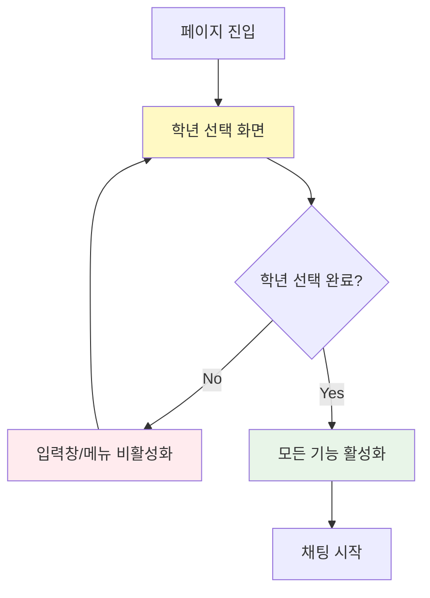
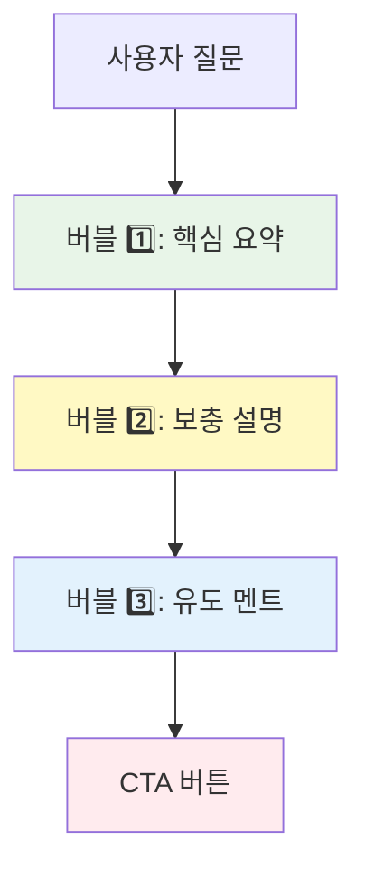

# 사용자 경험(UX) 가이드라인

## 개요

AI Navi 프론트엔드의 사용자 경험 설계 원칙과 실제 적용 방법을 정의합니다. 실제 GitHub 이슈 해결 과정에서 도출된 UX 패턴과 Notion에서 정의한 AI Navi 답변 생성 정책을 반영합니다.

## 1. 핵심 UX 원칙

### 1.1 사용자 플로우 단순화

**원칙**: 필수 단계를 명확히 하여 사용자 혼란 최소화

#### 실제 적용 사례: 이슈 #32 학년 선택 우선 순위



**구현 방법**:
```typescript
// 상태 기반 UI 제어
const ChatInterface = () => {
  const [selectedGrade, setSelectedGrade] = useState<Grade | null>(null);
  const isGradeSelected = selectedGrade !== null;
  
  return (
    <div className="chat-interface">
      {!isGradeSelected && (
        <GradeSelection onSelect={setSelectedGrade} />
      )}
      
      <ChatInput 
        disabled={!isGradeSelected}
        placeholder={
          !isGradeSelected 
            ? "학년을 먼저 선택해주세요" 
            : "메시지를 입력하세요"
        }
      />
      
      <MenuButton disabled={!isGradeSelected} />
    </div>
  );
};
```

### 1.2 반응형 일관성

**원칙**: 모든 디바이스에서 일관된 경험 제공

#### 실제 적용 사례: 이슈 #44 PC/모바일 너비 통일

```css
/* 반응형 디자인 패턴 */
.modal-container {
  /* 모바일: 전체 너비 */
  @apply w-full;
  
  /* PC: 고정 너비 500px */
  @apply sm:w-[500px] sm:max-w-[500px];
}

.menu-modal {
  /* 모바일: 하단에서 올라오는 형태 */
  @apply transform transition-transform duration-300;
  @apply translate-y-full;
  
  /* PC: 중앙 정렬 */
  @apply sm:mb-4 sm:translate-y-0;
}
```

**디자인 토큰**:
```typescript
export const BREAKPOINTS = {
  mobile: '0px',
  tablet: '768px',
  desktop: '1024px'
} as const;

export const MODAL_SIZES = {
  mobile: {
    width: '100%',
    height: '90%'
  },
  desktop: {
    width: '500px',
    height: '100%'
  }
} as const;
```

### 1.3 즉시 피드백 제공

**원칙**: 사용자 행동에 대한 즉각적인 시각적 피드백

```typescript
// 로딩 상태 표시
const ChatInput = ({ onSend, disabled }) => {
  const [isLoading, setIsLoading] = useState(false);
  
  const handleSend = async (message: string) => {
    setIsLoading(true);
    try {
      await onSend(message);
    } finally {
      setIsLoading(false);
    }
  };
  
  return (
    <div className="relative">
      <input disabled={disabled || isLoading} />
      <Button 
        disabled={disabled || isLoading}
        className={isLoading ? 'opacity-50' : ''}
      >
        {isLoading ? <Spinner /> : <SendIcon />}
      </Button>
    </div>
  );
};
```

## 2. AI 챗봇 UX 특화 가이드라인

### 2.1 버블 메시지 설계 원칙

Notion "AI Navi Chatbot 답변 생성 정책"에 기반한 사용자 친화적 메시지 구조:

#### 3단계 버블 구조



**구현 예시**:
```typescript
interface BubbleResponse {
  type: 'main' | 'sub' | 'cta';
  text: string;
  attachment?: AttachmentData;
}

const ChatBubbleGroup = ({ responses }: { responses: BubbleResponse[] }) => {
  return (
    <div className="space-y-2">
      {responses.map((response, index) => (
        <ChatBubble
          key={index}
          type={response.type}
          text={response.text}
          attachment={response.attachment}
          className={getBubbleStyles(response.type)}
        />
      ))}
    </div>
  );
};

const getBubbleStyles = (type: BubbleResponse['type']) => {
  switch (type) {
    case 'main':
      return 'bg-blue-50 border-l-4 border-blue-500 font-semibold';
    case 'sub': 
      return 'bg-gray-50 border border-gray-200';
    case 'cta':
      return 'bg-orange-50 border border-orange-200';
  }
};
```

### 2.2 학년별 맞춤형 UX

#### 실제 적용 사례: 이슈 #29 동적 질문 표시

```typescript
// 학년별 질문 카테고리 및 내용 동적 표시
const QuestionSelector = ({ selectedGrade }: { selectedGrade: Grade }) => {
  const categories = GRADE_CATEGORIES[selectedGrade];
  const [selectedCategory, setSelectedCategory] = useState<string>();
  
  return (
    <div className="space-y-4">
      {/* 카테고리 선택 */}
      <div className="grid grid-cols-3 gap-2">
        {categories.map((category) => (
          <Button
            key={category.id}
            variant={selectedCategory === category.id ? 'primary' : 'secondary'}
            onClick={() => setSelectedCategory(category.id)}
            className="text-xs py-2"
          >
            {category.name}
          </Button>
        ))}
      </div>
      
      {/* 학년별 질문 목록 */}
      {selectedCategory && (
        <QuestionList 
          grade={selectedGrade}
          category={selectedCategory}
        />
      )}
    </div>
  );
};

// 학년별 질문 데이터
const GRADE_QUESTIONS = {
  '高校生': {
    '授業・カリキュラム': [
      '大学受験対策はどの科目に対応していますか？',
      '難関大学向けの指導はありますか？'
    ]
  },
  '中学生': {
    '授業・カリキュラム': [
      '定期テスト対策はしてもらえますか？',
      '学校の教科書に合わせた授業ですか？'
    ]
  }
} as const;
```

### 2.3 에러 상황 UX

#### 실제 적용 사례: 이슈 #41 LLM 에러 처리

```typescript
// 사용자 친화적 에러 메시지
const ErrorBubble = ({ error }: { error: LLMError }) => {
  const getErrorMessage = (error: LLMError) => {
    switch (error.type) {
      case 'network':
        return '인터넷 연결을 확인해주세요 🌐';
      case 'timeout':
        return '응답 시간이 초과되었습니다. 다시 시도해주세요 ⏰';
      case 'llm_error':
      default:
        return '申し訳ありません😭一時的なエラーが発生しています。一度チャットを閉じてから再度お試しください。';
    }
  };
  
  return (
    <div className="bg-red-50 border border-red-200 rounded-lg p-4">
      <div className="flex items-start space-x-3">
        <div className="text-red-500">
          <AlertCircle size={20} />
        </div>
        <div className="flex-1">
          <p className="text-red-800 text-sm">
            {getErrorMessage(error)}
          </p>
          <Button 
            variant="outline" 
            size="sm" 
            className="mt-2 border-red-300 text-red-700"
            onClick={() => window.location.reload()}
          >
            다시 시도
          </Button>
        </div>
      </div>
    </div>
  );
};
```

## 3. 접근성 (Accessibility) 가이드라인

### 3.1 키보드 네비게이션

```typescript
// ESC 키로 모달 닫기
const useModalKeyboard = (isOpen: boolean, onClose: () => void) => {
  useEffect(() => {
    const handleKeyDown = (event: KeyboardEvent) => {
      if (event.key === 'Escape' && isOpen) {
        onClose();
      }
    };
    
    if (isOpen) {
      document.addEventListener('keydown', handleKeyDown);
      // 포커스 트랩
      document.body.style.overflow = 'hidden';
    }
    
    return () => {
      document.removeEventListener('keydown', handleKeyDown);
      document.body.style.overflow = '';
    };
  }, [isOpen, onClose]);
};

// Tab 키 순서 관리
const ChatInterface = () => {
  return (
    <div>
      <GradeSelection tabIndex={1} />
      <ChatInput tabIndex={2} />
      <MenuButton tabIndex={3} />
    </div>
  );
};
```

### 3.2 스크린 리더 지원

```typescript
// ARIA 레이블 및 역할 정의
const ChatBubble = ({ type, text, timestamp }) => {
  return (
    <div 
      role="article"
      aria-label={`${type === 'main' ? '주요' : '보조'} 응답 메시지`}
      className="chat-bubble"
    >
      <div aria-live="polite">
        {text}
      </div>
      {timestamp && (
        <time 
          dateTime={timestamp.toISOString()}
          className="sr-only"
        >
          {timestamp.toLocaleString()}
        </time>
      )}
    </div>
  );
};

// 로딩 상태 안내
const LoadingIndicator = () => {
  return (
    <div 
      role="status" 
      aria-live="polite"
      aria-label="AI가 응답을 생성 중입니다"
    >
      <div className="flex items-center space-x-2">
        <Spinner />
        <span className="sr-only">응답 생성 중...</span>
      </div>
    </div>
  );
};
```

## 4. 모바일 UX 최적화

### 4.1 터치 인터페이스

```typescript
// 터치 제스처 지원
const SwipeableModal = ({ children, onClose }) => {
  const [startY, setStartY] = useState(0);
  const [currentY, setCurrentY] = useState(0);
  
  const handleTouchStart = (e: TouchEvent) => {
    setStartY(e.touches[0].clientY);
  };
  
  const handleTouchMove = (e: TouchEvent) => {
    setCurrentY(e.touches[0].clientY);
  };
  
  const handleTouchEnd = () => {
    const diffY = currentY - startY;
    
    // 아래로 150px 이상 스와이프시 모달 닫기
    if (diffY > 150) {
      onClose();
    }
    
    setStartY(0);
    setCurrentY(0);
  };
  
  return (
    <div
      onTouchStart={handleTouchStart}
      onTouchMove={handleTouchMove}
      onTouchEnd={handleTouchEnd}
      className="modal-container"
    >
      {children}
    </div>
  );
};
```

### 4.2 Safe Area 고려

```css
/* iOS Safe Area 대응 */
.modal-bottom {
  padding-bottom: max(1rem, env(safe-area-inset-bottom));
}

.chat-input {
  padding-bottom: calc(1rem + env(safe-area-inset-bottom));
}
```

## 5. 성능 UX

### 5.1 지각된 성능 최적화

```typescript
// 스켈레톤 로딩
const ChatBubbleSkeleton = () => {
  return (
    <div className="animate-pulse">
      <div className="bg-gray-200 rounded-lg p-4 space-y-2">
        <div className="h-4 bg-gray-300 rounded w-3/4"></div>
        <div className="h-4 bg-gray-300 rounded w-1/2"></div>
      </div>
    </div>
  );
};

// 점진적 로딩
const ChatMessages = ({ messages, isLoading }) => {
  return (
    <div className="space-y-4">
      {messages.map(message => (
        <ChatBubble key={message.id} {...message} />
      ))}
      
      {isLoading && <ChatBubbleSkeleton />}
    </div>
  );
};
```

### 5.2 이미지 최적화

```typescript
// 지연 로딩 이미지
const OptimizedImage = ({ src, alt, className }) => {
  const [isLoaded, setIsLoaded] = useState(false);
  const [hasError, setHasError] = useState(false);
  
  return (
    <div className={`relative ${className}`}>
      {!isLoaded && !hasError && (
        <div className="absolute inset-0 bg-gray-200 animate-pulse rounded" />
      )}
      
       setIsLoaded(true)}
        onError={() => setHasError(true)}
        className={`transition-opacity duration-300 ${
          isLoaded ? 'opacity-100' : 'opacity-0'
        }`}
      />
      
      {hasError && (
        <div className="absolute inset-0 bg-gray-100 flex items-center justify-center">
          <span className="text-gray-500 text-sm">이미지를 불러올 수 없습니다</span>
        </div>
      )}
    </div>
  );
};
```

## 6. 다국어 UX

### 6.1 언어별 레이아웃 조정

```typescript
// 일본어/한국어 텍스트 길이 차이 고려
const LocalizedButton = ({ children, locale }) => {
  const getButtonSize = (locale: string) => {
    switch (locale) {
      case 'ja':
        return 'px-6 py-2'; // 일본어는 더 넓게
      case 'ko':
        return 'px-4 py-2'; // 한국어는 기본
      case 'en':
        return 'px-5 py-2'; // 영어는 중간
      default:
        return 'px-4 py-2';
    }
  };
  
  return (
    <button className={`${getButtonSize(locale)} rounded-md`}>
      {children}
    </button>
  );
};
```

### 6.2 문화적 맥락 고려

```typescript
// 언어별 에러 메시지 톤앤매너
const ERROR_MESSAGES = {
  ja: {
    polite: '申し訳ありません😭一時的なエラーが発生しています。',
    action: '一度チャットを閉じてから再度お試しください。'
  },
  ko: {
    polite: '죄송합니다😭일시적인 오류가 발생했습니다.',
    action: '채팅을 닫고 다시 시도해주세요.'
  }
} as const;
```

## 7. 사용자 테스트 가이드라인

### 7.1 A/B 테스트 패턴

```typescript
// 기능 플래그를 활용한 A/B 테스트
const useFeatureFlag = (flagName: string) => {
  return process.env.NODE_ENV === 'development' || 
         localStorage.getItem(`feature_${flagName}`) === 'true';
};

const ChatInput = () => {
  const useNewInputDesign = useFeatureFlag('new_input_design');
  
  return useNewInputDesign ? (
    <NewChatInput />
  ) : (
    <LegacyChatInput />
  );
};
```

### 7.2 사용자 행동 분석

```typescript
// 사용자 상호작용 추적
const useAnalytics = () => {
  const trackEvent = useCallback((event: string, properties?: object) => {
    if (process.env.NODE_ENV === 'production') {
      // 분석 도구로 이벤트 전송
      analytics.track(event, properties);
    }
  }, []);
  
  return { trackEvent };
};

const ChatBubble = ({ type, text, onCTAClick }) => {
  const { trackEvent } = useAnalytics();
  
  const handleCTAClick = () => {
    trackEvent('cta_clicked', {
      bubble_type: type,
      text_length: text.length
    });
    
    onCTAClick?.();
  };
  
  return (
    <div>
      {/* 버블 내용 */}
      {type === 'cta' && (
        <Button onClick={handleCTAClick}>
          자세히 보기
        </Button>
      )}
    </div>
  );
};
```

## 8. 디자인 시스템 연동

### 8.1 일관된 시각적 언어

```typescript
// 디자인 토큰 활용
export const DESIGN_TOKENS = {
  colors: {
    primary: {
      50: '#eff6ff',
      500: '#3b82f6',
      600: '#2563eb'
    },
    accent: {
      orange: '#f97316',
      blue: '#3b82f6'
    }
  },
  spacing: {
    xs: '0.25rem',
    sm: '0.5rem',
    md: '1rem',
    lg: '1.5rem'
  },
  typography: {
    sizes: {
      xs: '0.75rem',
      sm: '0.875rem',
      base: '1rem',
      lg: '1.125rem'
    }
  }
} as const;

// 컴포넌트에서 활용
const ChatBubble = ({ accentColor }) => {
  const colors = getColorClasses(accentColor);
  
  return (
    <div 
      className={`
        p-${DESIGN_TOKENS.spacing.md} 
        rounded-lg 
        ${colors.bgLight}
      `}
    >
      {/* 내용 */}
    </div>
  );
};
```

## 9. 실제 사용자 피드백 반영

### GitHub 이슈를 통한 UX 개선 사례

1. **이슈 #32**: 사용자가 학년 선택 없이 진행하려 할 때의 혼란 → 필수 단계 명확화
2. **이슈 #44**: PC와 모바일 간 일관성 부족 → 반응형 디자인 통일
3. **이슈 #41**: 에러 상황에서 사용자 안내 부족 → 친화적 에러 메시지

## 10. 지속적 개선 프로세스

### 10.1 UX 메트릭 모니터링

```typescript
// 사용자 경험 지표 추적
const UX_METRICS = {
  timeToFirstInteraction: 'TTFI',
  taskCompletionRate: 'TCR',
  errorRecoveryRate: 'ERR',
  userSatisfactionScore: 'USS'
} as const;

const useUXMetrics = () => {
  const startTime = useRef(Date.now());
  
  const measureTTFI = useCallback(() => {
    const ttfi = Date.now() - startTime.current;
    trackMetric('TTFI', ttfi);
  }, []);
  
  return { measureTTFI };
};
```

### 10.2 피드백 수집 시스템

```typescript
// 인앱 피드백 위젯
const FeedbackWidget = () => {
  const [isOpen, setIsOpen] = useState(false);
  const [feedback, setFeedback] = useState('');
  const [rating, setRating] = useState(0);
  
  const submitFeedback = async () => {
    await api.submitFeedback({
      feedback,
      rating,
      url: window.location.pathname,
      timestamp: new Date().toISOString()
    });
    
    setIsOpen(false);
    toast.success('피드백이 전송되었습니다!');
  };
  
  return (
    <div className="fixed bottom-4 right-4">
      <Button onClick={() => setIsOpen(true)}>
        💬 피드백
      </Button>
      
      {isOpen && (
        <FeedbackModal 
          onSubmit={submitFeedback}
          onClose={() => setIsOpen(false)}
        />
      )}
    </div>
  );
};
```

## 관련 문서

- [프론트엔드 컴포넌트 패턴](frontend-component-patterns.md)
- [학년별 컨텐츠 맞춤화 전략](../ADR/ADR-004-grade-based-content-customization.md)
- [반응형 디자인 전략](../ADR/ADR-005-responsive-design-strategy.md)
- [학년별 교육 시스템 배경](../background_context/grade-based-education-context.md)
- [고객 서비스 워크플로우](../background_context/customer-service-workflow.md)

## 참고 자료

- [AI Navi Chatbot 답변 생성 정책 (Notion)](https://www.notion.so/23445c9756f8806c944dd386622577c0)
- [MeetA Development Concept (Notion)](https://www.notion.so/23845c9756f8805baf14efeaae60febf)
- [Material Design Guidelines](https://material.io/design)
- [Apple Human Interface Guidelines](https://developer.apple.com/design/human-interface-guidelines/)
- [Web Content Accessibility Guidelines (WCAG)](https://www.w3.org/WAI/WCAG21/quickref/)

---

**최종 업데이트**: 2025-07-26  
**작성자**: Frontend Development Team