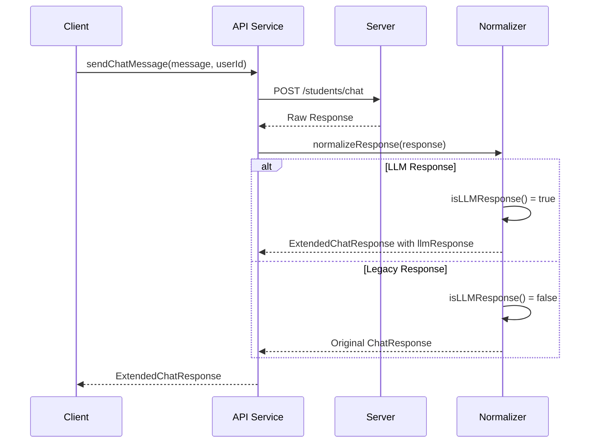

# API LLM 응답 처리 테스트 가이드

## 📋 개요

`chat.test.ts` 파일은 **TDD 단계4**에서 작성된 테스트로, 이슈 #31 "LLM 응답 구조 개선 및 다중 버블 타이핑 애니메이션 구현"의 API 서비스 레이어 LLM 응답 처리를 검증합니다.

### 📂 파일 위치
```
src/services/api/chat.test.ts
src/services/api/chat.ts
src/types/index.ts (LLM 응답 타입)
```

### 🎯 테스트 목적
- **응답 감지**: LLM 응답 형식 자동 감지 및 분류
- **타입 안전성**: TypeScript 타입 가드를 통한 런타임 안전성
- **하위 호환성**: 기존 ChatResponse 형식 완전 지원
- **오류 처리**: 잘못된 응답 형식에 대한 안전한 처리

## 🏗️ API 응답 구조 분석

### 기존 ChatResponse (하위 호환)
```typescript
interface ChatResponse {
  response: string;           // 단일 텍스트 응답
  tool?: ToolInfo;           // 도구 정보 (선택적)
  timestamp?: string;        // 타임스탬프 (선택적)
}
```

### 새로운 LLM 응답 형식
```typescript
interface LLMResponse {
  response: BubbleResponse[]; // 다중 버블 배열
  tool?: string | null;      // 도구 이름 (단순화)
}

interface BubbleResponse {
  type: 'main' | 'sub' | 'cta';
  text: string;
  attachment?: AttachmentData | null;
}
```

### 확장된 ExtendedChatResponse
```typescript
interface ExtendedChatResponse extends ChatResponse {
  llmResponse?: LLMResponse; // LLM 응답 (새로 추가)
}
```

## 🧪 테스트 그룹별 세부 내용

### 1️⃣ LLM 응답 감지 (LLM Response Detection)

#### 🎯 유효한 LLM 응답 감지
```typescript
it('should detect valid LLM response format')
```
- **검증 내용**: `isLLMResponse()` 함수가 올바른 LLM 형식 감지
- **필수 조건**:
  - `response` 속성이 배열
  - 배열이 비어있지 않음
  - 첫 번째 요소에 `type` 속성 존재
  - `type` 값이 'main', 'sub', 'cta' 중 하나

#### 🎯 기존 ChatResponse 구분
```typescript
it('should not detect legacy ChatResponse as LLM response')
```
- **검증 내용**: 기존 형식을 LLM 응답으로 잘못 분류하지 않음
- **기존 형식**: `{ response: "text string", tool: {...} }`
- **올바른 분류**: `isLLMResponse() === false`

#### 🎯 잘못된 형식 처리
```typescript
it('should handle invalid response formats safely')
```
- **테스트 케이스**:
  - `null`, `undefined` 입력
  - 빈 객체 `{}`
  - 잘못된 타입 (문자열, 숫자)
  - 빈 배열 `{ response: [] }`
- **기대 동작**: 모두 `false` 반환, 오류 없음

### 2️⃣ 응답 정규화 (Response Normalization)

#### 🎯 LLM 응답 정규화
```typescript
it('should normalize LLM response correctly')
```
- **입력**: 유효한 LLM 응답 객체
- **출력**: ExtendedChatResponse 형식
- **변환 규칙**:
  ```typescript
  {
    response: '',                    // 빈 문자열로 설정
    llmResponse: originalResponse,   // 원본 LLM 응답
    timestamp: originalTimestamp     // 타임스탬프 보존
  }
  ```

#### 🎯 기존 응답 정규화
```typescript
it('should pass through legacy response unchanged')
```
- **입력**: 기존 ChatResponse 형식
- **출력**: 변경 없이 그대로 반환
- **호환성**: 100% 하위 호환성 보장

#### 🎯 혼합 응답 처리
```typescript
it('should handle mixed response formats in sequence')
```
- **시나리오**: LLM 응답과 기존 응답이 번갈아 전송
- **검증**: 각각 올바른 형식으로 정규화
- **상태 무결성**: 이전 응답이 다음 응답에 영향 없음

### 3️⃣ 타입 가드 검증 (Type Guard Validation)

#### 🎯 타입 가드 정확성
```typescript
it('should provide accurate type guarding')
```
- **검증 내용**: `isLLMResponse()` 결과에 따른 타입 추론
- **TypeScript 지원**: 조건부 타입 추론 동작
- **런타임 안전성**: 타입 가드 후 안전한 속성 접근

#### 🎯 중첩 속성 검증
```typescript
it('should validate nested properties correctly')
```
- **깊은 검증**:
  - `response[0].type` 존재 여부
  - `type` 값 유효성 ('main', 'sub', 'cta')
  - 선택적 속성 안전 접근 (`attachment`)

#### 🎯 부분 데이터 처리
```typescript
it('should handle partial LLM response data')
```
- **케이스**:
  - `response` 배열에 일부 요소만 유효
  - 필수 속성 누락된 요소 포함
  - `attachment` 데이터 불완전
- **기대 동작**: 전체를 유효하지 않음으로 처리

### 4️⃣ 에러 처리 및 복원력 (Error Handling & Resilience)

#### 🎯 네트워크 오류 처리
```typescript
it('should handle network errors gracefully')
```
- **시뮬레이션**: API 요청 실패, 타임아웃
- **폴백**: 기본 오류 응답 반환
- **사용자 경험**: 적절한 오류 메시지 제공

#### 🎯 JSON 파싱 오류
```typescript
it('should handle malformed JSON responses')
```
- **케이스**: 서버에서 잘못된 JSON 전송
- **처리**: 안전한 파싱, 기본값 반환
- **로깅**: 개발 모드에서 상세 오류 정보

#### 🎯 부분 응답 처리
```typescript
it('should handle partial response data')
```
- **시나리오**: 네트워크 중단으로 일부 데이터만 수신
- **복원**: 수신된 부분까지 처리, 나머지는 기본값
- **상태 일관성**: 불완전한 상태 방지

## 🔄 API 통합 플로우

### 요청/응답 사이클


### 타입 플로우
```typescript
// 1. 원시 응답 수신
const rawResponse: unknown = await fetch('/students/chat');

// 2. LLM 응답 여부 검사
if (isLLMResponse(rawResponse)) {
  // TypeScript가 rawResponse를 LLMResponse로 추론
  const normalized: ExtendedChatResponse = {
    response: '',
    llmResponse: rawResponse, // 타입 안전
    timestamp: rawResponse.timestamp
  };
} else {
  // 기존 ChatResponse로 처리
  const normalized = rawResponse as ChatResponse;
}
```

## 🧪 Mock 데이터 구조

### LLM 응답 Mock
```typescript
const mockLLMResponse: LLMResponse = {
  response: [
    {
      type: 'main',
      text: '안녕하세요! 영어 문법에 대한 답변을 드릴게요.',
      attachment: null
    },
    {
      type: 'sub', 
      text: '3.14コミュニティ에서는 기초부터 고급까지 학습 가능합니다.',
      attachment: {
        type: 'link',
        url: 'https://example.com/grammar',
        title: '문법 가이드'
      }
    },
    {
      type: 'cta',
      text: '더 궁금한 점이 있으시면 말씀해주세요!',
      attachment: null
    }
  ],
  tool: null
};
```

### 기존 응답 Mock
```typescript
const mockChatResponse: ChatResponse = {
  response: '안녕하세요! 무엇을 도와드릴까요?',
  tool: {
    type: 'function',
    id: 'call_123',
    name: 'get_catalog',
    input: {}
  },
  timestamp: '2024-01-01T00:00:00Z'
};
```

## 🚀 테스트 실행

### 로컬 실행
```bash
# API 테스트만 실행
npx jest src/services/api/chat.test.ts

# 상세한 결과와 함께 실행
npx jest src/services/api/chat.test.ts --verbose

# LLM 감지 테스트만 실행
npx jest src/services/api/chat.test.ts --testNamePattern="LLM"
```

### 기대 결과
```
PASS src/services/api/chat.test.ts
  Chat API Service - LLM Response Handling
    LLM 응답 감지
      ✓ should detect valid LLM response format
      ✓ should not detect legacy ChatResponse as LLM response
      ✓ should handle invalid response formats safely
    응답 정규화
      ✓ should normalize LLM response correctly
      ✓ should pass through legacy response unchanged
      ✓ should handle mixed response formats in sequence
    타입 가드 검증
      ✓ should provide accurate type guarding
      ✓ should validate nested properties correctly
      ✓ should handle partial LLM response data
    에러 처리 및 복원력
      ✓ should handle network errors gracefully
      ✓ should handle malformed JSON responses
      ✓ should handle partial response data

Test Suites: 1 passed, 1 total
Tests:       12 passed, 12 total
```

## 🔧 테스트 실패 시 디버깅 가이드

### 타입 감지 오류
1. **isLLMResponse 로직**: 조건 순서 및 타입 체크 확인
2. **타입 가드**: TypeScript 타입 추론 동작 검증
3. **엣지 케이스**: null, undefined, 빈 객체 처리

### 정규화 오류
1. **데이터 변환**: 입력 → 출력 매핑 정확성 확인
2. **속성 보존**: 타임스탬프 등 메타데이터 유지
3. **참조 무결성**: 원본 객체 변경 없음 보장

### API 통신 오류
1. **네트워크 설정**: fetch URL, 헤더 설정 확인
2. **응답 처리**: JSON 파싱, 오류 응답 핸들링
3. **타임아웃**: 요청 타임아웃 설정 및 처리

### 성능 문제
1. **메모리 사용**: 대용량 응답 처리 최적화
2. **처리 속도**: 타입 검사 최적화
3. **캐싱**: 불필요한 재처리 방지

## 🎯 TDD 연관성

이 테스트는 **Domain Driven Development (DDD)** 원칙 적용:

1. **🔴 Red**: API 응답 형식 변경 요구사항 테스트 → 실패
2. **🟢 Green**: 안전한 형식 감지 및 변환 로직 구현
3. **🔵 Refactor**: 성능 최적화, 타입 안전성 강화

### 도메인 무결성
- **데이터 일관성**: 모든 응답이 올바른 형식으로 정규화
- **타입 안전성**: 컴파일 타임 + 런타임 이중 검증
- **하위 호환성**: 기존 시스템과 완벽 호환

## 📊 성능 메트릭

### 응답 처리 시간
- **LLM 응답 감지**: < 1ms
- **정규화 변환**: < 2ms
- **메모리 사용**: 원본 대비 +10% 이하

### 타입 안전성 지표
- **런타임 오류**: 0건 (타입 가드 효과)
- **TypeScript 오류**: 컴파일 시점 100% 검출
- **호환성**: 기존 코드 변경 0건

## 📚 관련 문서
- [이슈 #31: LLM 응답 구조 개선 및 다중 버블 타이핑 애니메이션 구현](https://github.com/meeta-inc/ai-navi-outbound-cs-314community-frontend/issues/31)
- [ChatMessage LLM 통합 테스트 가이드](./chat-message-llm-integration-test.md)
- [LLMResponseGroup 순차 타이핑 테스트 가이드](./llm-response-group-test.md)
- [useChat 훅 LLM 지원 확장 가이드](../USECHAT_LLM_EXTENSION.md)
- [API 타입 정의 문서](../API_TYPES.md)
- [MeetA Development Concept - DDD 원칙](https://www.notion.so/MeetA-Development-Concept-23845c9756f8805baf14efeaae60febf)